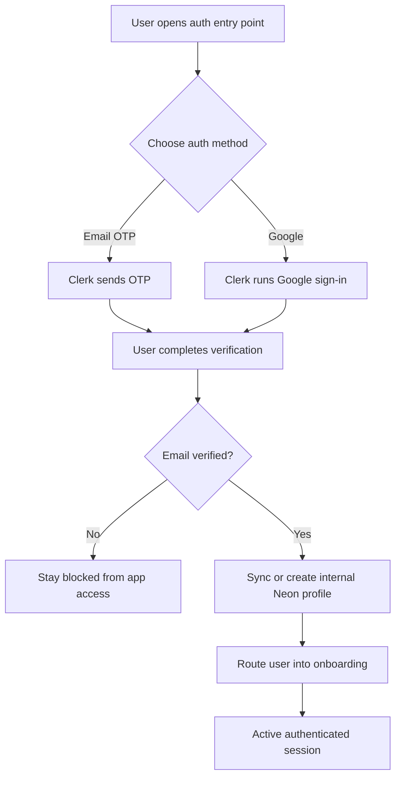
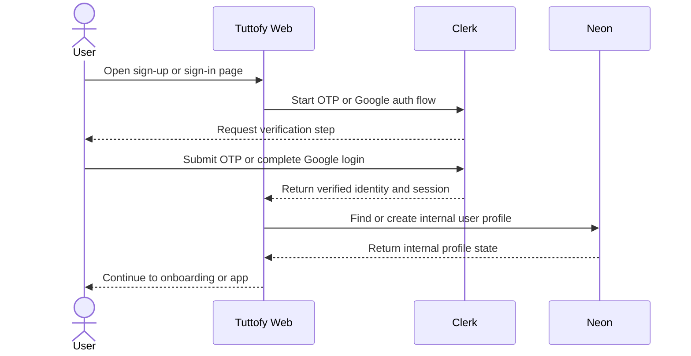

# Authentication

## Overview

Authentication in Tuttofy core web controls how learners and tutors create accounts, verify identity, start sessions, and access the product safely. Tuttofy uses Clerk as the full authentication provider while keeping a custom auth UI in Next.js for the product experience.

## Purpose

This feature exists to ensure that only verified users can access the Tuttofy core product, that identity is managed consistently across email and Google login methods, and that internal application profiles can be connected to a reliable user record before onboarding begins.

## Users / Roles

- Learner
- Tutor
- Internal product and engineering teams that rely on the identity model

## Main Flow

1. A new user opens the shared sign-up entry point in the Tuttofy core web app.
2. The user chooses either passwordless email OTP or Google as the authentication method.
3. If the user uses email OTP, Clerk sends the verification code to the user's email and the user enters the code in Tuttofy's custom auth UI.
4. If the user uses Google, Clerk completes the Google sign-in flow and returns the authenticated identity to Tuttofy.
5. Tuttofy requires a verified email before granting application access.
6. After the first verified sign-in succeeds, Tuttofy creates or completes the matching internal user or profile record in Neon if needed.
7. The verified user is routed into onboarding before using the main product experience.
8. On later visits, the same user signs in again with email OTP or Google and Clerk restores the active session.
9. When the user signs out, Clerk ends the session and Tuttofy returns the user to an unauthenticated state.

## Visual Flow

## Interaction Sequence

## Business Rules

- `Clerk` fully handles sign-up, sign-in, verification, and session lifecycle for the Tuttofy core web app.
- Tuttofy uses custom authentication screens in `Next.js`, not Clerk-hosted default pages.
- The allowed authentication methods in this phase are only `passwordless email OTP` and `Google`.
- `Google` is the only supported social provider in this phase.
- A user must complete email verification before accessing the application.
- A verified email represents one account identity even if the same user signs in through both email OTP and Google.
- One account may later hold multiple product roles such as learner and tutor.
- `Clerk` is the source of truth for identity and authentication state.
- `Neon` is the source of truth for internal application data after a user is recognized by Clerk.
- `clerk_user_id` is the primary link between Clerk identity and Tuttofy internal records.
- Onboarding begins only after the first verified sign-in succeeds.
- Admin authentication is out of scope for this flow because the admin system lives in a separate application.
- Payment or subscription authentication behavior is out of scope for this phase.

## Data / Fields

- `clerk_user_id`
- `primary_email`
- `email_verification_status`
- `auth_provider`
- `connected_providers`
- `session_status`
- `app_role_state`
- `onboarding_status`
- `internal_user_profile_id`

## Edge Cases

- The entered OTP is incorrect.
- The OTP has expired and the user must request a new code.
- The email is already associated with an existing account.
- The user signs in with Google using the same verified email that was previously used for email OTP.
- Clerk authenticates the user but Neon does not yet have the matching internal user or profile record.
- The user attempts to access the app before email verification is complete.
- The user signs out during onboarding and later returns to finish the remaining setup.

## Related Features

- Onboarding
- User profile
- Teacher profile
- Join tutor or class
- Tech Stack

## Notes

- Password-based local authentication is not part of the current Tuttofy core web scope.
- Tutor and learner accounts use the same authentication entry point and diverge later through onboarding, profile state, or permissions.
- The current documentation scope does not include internal admin login, non-Google social providers, or payment and subscription flows.
