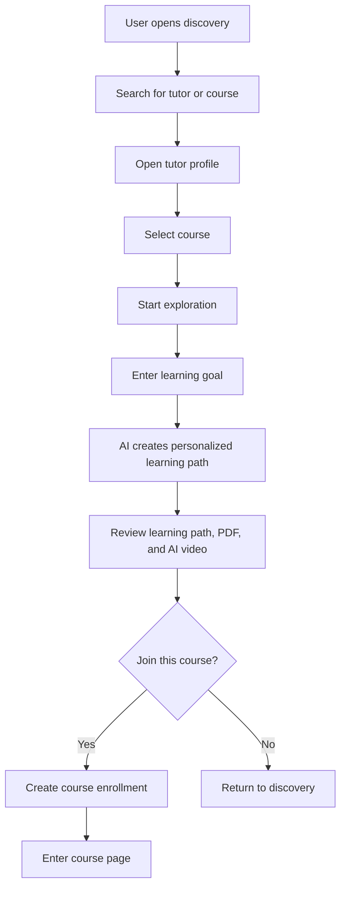
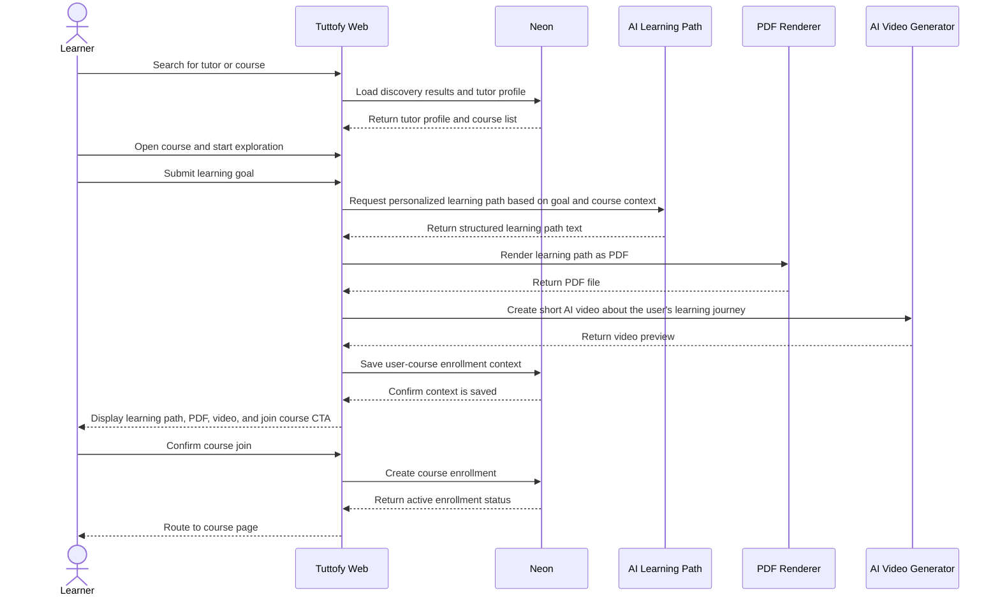

# Course Discovery and Join

## Overview

Course discovery and join in Tuttofy defines how learners find tutors, review tutor profiles, choose a course, go through `exploration`, receive a `personalized learning path`, and decide whether to join the course. This feature is the academic onboarding gateway for each course and ensures every enrollment starts from a clear learning goal.

## Purpose

This feature helps learners find relevant courses, understand who the tutor is, and receive a personalized experience before joining. Exploration and the learning path increase user confidence in the course, clarify the learning direction, and give Tuttofy an official context that can be used for future learning personalization.

## Users / Roles

- Student
- Parent
- Child
- Tutor
- Internal product and engineering teams

## Main Flow

1. The learner opens the discovery area after onboarding is complete.
2. The learner searches for a tutor or course by topic, learning need, or available filters.
3. The learner opens a tutor profile to view `about the teacher`, `experience`, `certificates`, and the list of courses created by the tutor.
4. The learner selects one course they want to study.
5. Before joining the course, the learner must press the `Exploration` button.
6. During exploration, the learner writes their learning goal in a textarea.
7. AI processes the user's goal together with the tutor and course context, then generates a `personalized learning path`.
8. Tuttofy stores the learning path as structured text data and also renders a `PDF` file that can be downloaded.
9. Tuttofy displays the learning path for the learner to read, provides a PDF download button, and shows an AI video that explains the learning journey they will follow if they use the course.
10. After the learner reviews the exploration result, the system displays the question `Join this course?`
11. If the learner agrees, the system creates an enrollment for the course and connects the user to a `user-course enrollment context` that contains the learning path.
12. After joining, the learner can enter the course page and choose the available learning modes inside the course.

## Visual Flow

## Interaction Sequence

## Business Rules

- Search, teacher profile review, exploration, learning path, and course join are treated as one discovery-to-enrollment feature sequence.
- Learners must be able to view the tutor profile before starting exploration.
- The minimum information on a tutor profile includes `about the teacher`, `experience`, `certificates`, and the course list.
- `Exploration` must be completed before the user can join a course.
- One course enrollment must have one active `user-course enrollment context`.
- The learning path is stored as text or structured data for internal system needs.
- The learning path must also be available as a downloadable `PDF` file.
- The AI video is part of the exploration experience and explains the user's learning journey for that course.
- `Join course` is available only after the learning path, PDF, and AI video have been prepared or are ready enough to display.
- If the user declines to join after exploration is complete, the learning path may still be stored as a draft context or preview context depending on the product implementation decision.
- Exploration must not automatically create access to modules or free conversation before course enrollment is active.
- The learning path scope must stay within the valid teacher profile, course goal, and knowledge scope.

## Data / Fields

- `teacher_profile_id`
- `teacher_about`
- `teacher_experience`
- `teacher_certificates[]`
- `course_id`
- `course_title`
- `course_description`
- `course_scope`
- `course_guardrails`
- `exploration_goal_text`
- `learning_path_id`
- `learning_path_text`
- `learning_path_structured_data`
- `learning_path_pdf_url`
- `learning_path_video_url`
- `learning_path_status`
- `course_enrollment_id`
- `course_enrollment_status`
- `user_course_context_id`
- `joined_at`

## Edge Cases

- No course results match the user's search.
- The tutor profile exists but the tutor does not have any active courses.
- The user opens a course but is not ready to enter an exploration goal.
- AI fails to create a learning path after the goal is submitted.
- PDF rendering fails even though the text learning path is created successfully.
- AI video generation fails even though the learning path and PDF are created successfully.
- The user closes the page after the learning path is created but before joining the course.
- The user tries to open the course directly without completing exploration.
- The user repeats exploration for the same course after already joining it.
- The user's goal is too broad or outside the course scope, so AI must still constrain the output.

## Related Features

- Authentication
- Onboarding
- Family account
- Teacher profile
- Course learning experience

## Notes

- This document combines `search course`, `teacher profile review`, `exploration`, `learning path`, and `join course` so the full pre-enrollment flow is documented as one sequence.
- Search ranking, SEO, or discovery recommendation details can be expanded in a later phase without changing this flow foundation.
