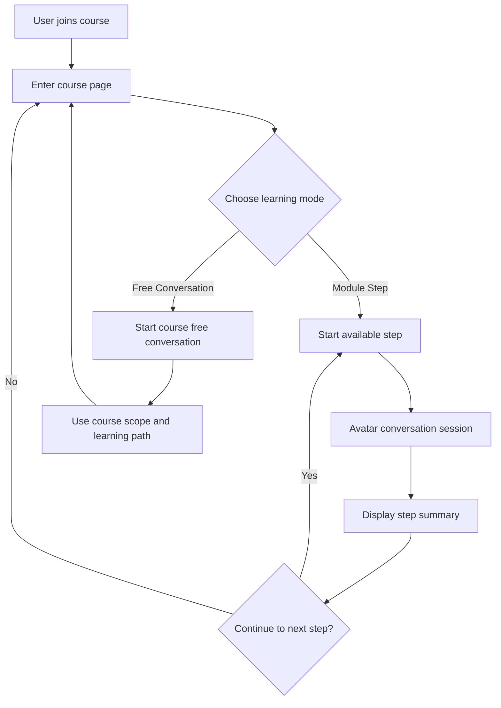
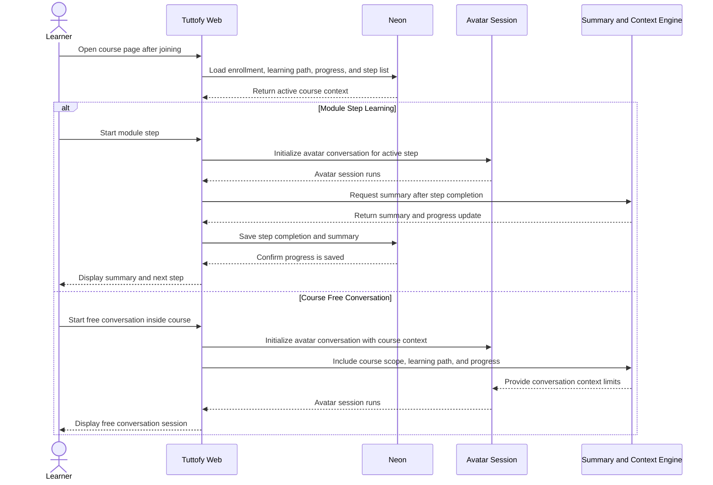

# Course Learning Experience

## Overview

Course learning experience in Tuttofy defines the learner experience after officially joining a course. This feature includes a structured learning path through `module step` or `milestone`, `course free conversation` mode, optional learning materials, and a `summary` after each completed step. The whole experience runs with the course context and the `user-course enrollment context` created during exploration.

## Purpose

This feature ensures learners have a clear learning experience after joining a course, whether they follow a sequential curriculum or ask questions more flexibly. Tuttofy needs to keep learning personal, relevant, and within the course scope while giving tutors room to design a coherent learning journey.

## Users / Roles

- Student
- Parent
- Child
- Tutor
- Internal product and engineering teams

## Main Flow

1. The learner completes exploration and joins the course.
2. Tuttofy opens the main course page based on the active enrollment and `user-course enrollment context`.
3. Inside the course, the learner sees a list of `module step` or `milestone` items arranged sequentially by the tutor.
4. The learner can start the first available step.
5. Each step runs as a `virtual conversation with avatar` session.
6. If the tutor provides learning materials or downloadable files, the learner can open them on the relevant step.
7. After the step is complete, Tuttofy generates a `summary` that recaps what was learned, the user's progress, and readiness for the next step.
8. If the next step is unlocked, the learner can continue sequentially.
9. In addition to following structured steps, the learner can also open `course free conversation`.
10. In free conversation, AI is still constrained by the course scope, course guardrails, the user's learning path, and the progress already made in that course.

## Visual Flow

## Interaction Sequence

## Business Rules

- All learning experiences after active enrollment must run at the `course` level, not the general tutor level.
- Tutors create a `course` first, then define `module step` or `milestone` items inside it.
- Each `module step` is one structured avatar learning session.
- Learners follow steps sequentially according to the order set by the tutor, unless the product supports more flexible unlock rules in the future.
- After one step is complete, the system must generate a `summary`.
- The summary should recap learning outcomes, progress, and an introduction to the next step.
- Learning materials on a step are optional.
- `Course free conversation` is always available at the course level, not the global tutor level.
- Free conversation must be constrained by `course scope`, `course guardrails`, `user-course enrollment context`, and `student progress`.
- Learners must not access modules or free conversation before course enrollment is active.
- If the tutor has not created any module steps, the learner can still use course free conversation as long as the course is open for enrollment.

## Data / Fields

- `course_id`
- `course_title`
- `course_scope`
- `course_guardrails`
- `course_enrollment_id`
- `user_course_context_id`
- `learning_path_id`
- `module_step_id`
- `module_step_title`
- `module_step_order`
- `module_step_status`
- `module_step_materials[]`
- `avatar_session_id`
- `step_completed_at`
- `step_summary_text`
- `step_summary_status`
- `course_progress_percent`
- `next_available_step_id`
- `free_conversation_session_id`

## Edge Cases

- The user joins a course but the tutor has not created any module steps.
- The user stops in the middle of an avatar step session and returns later.
- Summary generation fails even though the step is considered complete.
- The tutor updates the step order while students are already learning.
- Downloadable material is broken or cannot be opened.
- The user tries to open a step that has not been unlocked.
- The user uses free conversation for a topic too far outside the course scope.
- The user's learning path and step progress provide conflicting context, so the system must choose the most relevant context.
- Enrollment exists but the learning path context is missing or not yet synchronized.

## Related Features

- Course discovery and join
- Teacher profile
- Upload learning material
- Student learning progress
- Avatar conversation session

## Notes

- This document focuses on the learning experience after joining and intentionally does not repeat discovery, exploration, or family membership details.
- If Tuttofy later adds quizzes, assessments, or adaptive branching, that behavior can be added as an extension of the course learning experience.
