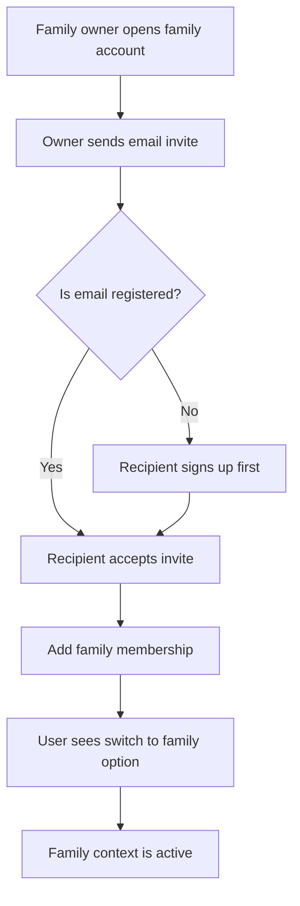
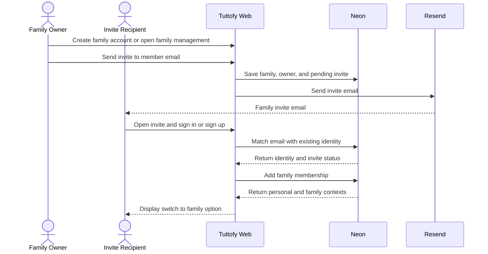

# Family Account

## Overview

Family account in Tuttofy allows one user identity to join a shared family context, where the `family owner` is the main billing owner and can invite other members by email. This feature is designed to support family learning patterns, such as parents who want to learn themselves, manage a child's learning experience, or share access within one family unit without creating a separate auth system.

## Purpose

This feature supports family usage scenarios with clear ownership and payment models. Family account helps Tuttofy separate login identity from usage context, so one user can keep the same account for personal and family needs while keeping billing, membership, and learning activity in the correct structure.

## Users / Roles

- Family owner
- Family member
- Parent
- Child
- Internal product and engineering teams

## Main Flow

1. The user creates or already has a Tuttofy account through the main auth flow.
2. The user who becomes the `family owner` creates a family account or activates a family context from an existing account.
3. The family owner sends an invite to a family member's email.
4. If the target email has never been registered, the invite recipient completes sign-up and then enters the invited family context.
5. If the target email already has a Tuttofy account, the invite recipient does not create a new account and only accepts membership on the same identity.
6. After the invite is accepted, the user sees the new context on the same account and can choose `switch to family`.
7. When entering the family context, the user only sees data, course enrollment, and learning experiences relevant to that family according to their permission.
8. Family billing remains attached to the family owner even as family members are added.

## Visual Flow

## Interaction Sequence

## Business Rules

- Family account is a `product context` or workspace, not a separate auth account.
- One identity can have more than one context, such as `personal` and `family`.
- Family invites must support both new emails and emails that are already registered in Tuttofy.
- If the invite email already has an account, the system must not create a new identity.
- The `family owner` is the main billing owner for the whole family account.
- Subscription, quota, or family pricing details are documented separately when the payment feature is active.
- Family membership is stored in the Tuttofy application data domain, not in Clerk.
- Invite acceptance must be based on the same email as the target invite email.
- The `switch to family` option appears only if the user has more than one context.
- Onboarding metadata such as `parent`, `child`, or `personal` does not automatically create family membership.
- Detailed permissions, such as who can invite other members, must follow the family role rules agreed by product.

## Data / Fields

- `family_id`
- `family_name`
- `family_owner_user_id`
- `family_membership_id`
- `family_membership_role`
- `family_membership_status`
- `invite_email`
- `invite_token`
- `invite_status`
- `invite_sent_at`
- `invite_accepted_at`
- `active_context`
- `available_contexts[]`
- `billing_owner_user_id`

## Edge Cases

- The invite email has a typo and the invite has not been accepted.
- The invite recipient opens the link while not logged in.
- The invite recipient opens the link with an account whose email is different from the invite email.
- The target email already has an account and is already a member of another family.
- The user has a personal context and several family contexts, so they need to choose the correct context.
- The family owner tries to invite an email that is already a member of the same family.
- The invite expires before it is accepted.
- The family owner cancels the invite before the recipient accepts it.
- Family billing has an issue but membership still exists.

## Related Features

- Authentication
- Onboarding
- User profile
- Join course
- Student learning progress

## Notes

- This document focuses on account context and membership, not the learning flow details inside a course.
- If Tuttofy supports children without independent login in the future, that scenario should be documented as an extension of family account rather than a change to core auth.
