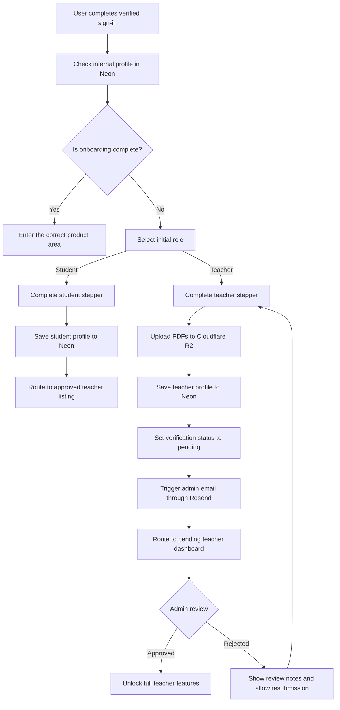
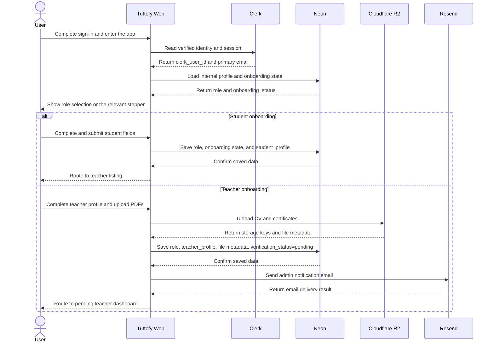

# Onboarding

## Overview

Onboarding in the Tuttofy core web app defines the first-login personalization flow after a user completes authentication and email verification. This feature assigns the user's initial role as `student` or `teacher`, collects the relevant profile data through a stepper form, and routes the user into the correct product experience while keeping core application data owned by Tuttofy systems.

## Purpose

This feature ensures that every new user has a complete internal profile, a clear initial role, and the correct entry point into the product immediately after the first verified sign-in. Onboarding also serves as the starting point for teacher verification before a teacher can access the full teacher feature set.

## Users / Roles

- Student
- Teacher
- Internal product and engineering teams
- Internal admin team that reviews teacher onboarding in a separate admin system

## Main Flow

1. The user completes sign-in and email verification through Clerk.
2. Tuttofy checks the user's `clerk_user_id` and internal profile state in Neon.
3. If the user does not yet have a complete internal profile or the `onboarding_status` is not `complete`, the user is routed into onboarding.
4. In the first step, the user selects one initial role: `student` or `teacher`.
5. If the user selects `student`, the user completes a stepper form with `full_name`, `birth_year`, `primary_language`, `other_languages[]`, and `learning_topics[]`.
6. After student onboarding is submitted, Tuttofy creates or completes the `student_profile` in Neon, marks onboarding as complete, and routes the user to the teacher listing of approved or published teachers.
7. If the user selects `teacher`, the user completes a stepper form with `full_name`, `birth_year`, `specialities[]`, then uploads `cv_file` and `certificate_files[]` as PDF files.
8. Tuttofy uploads teacher files to Cloudflare R2 first, then stores file metadata, profile data, and verification state in Neon.
9. After teacher onboarding is submitted, Tuttofy sets `verification_status` to `pending`, sends an internal admin notification email through Resend, and routes the teacher to the pending teacher dashboard.
10. While the teacher is in `pending`, the teacher can still update profile data, CV, and certificates, but all other teacher features remain locked until the status changes to `approved`.
11. If the teacher is `rejected`, the teacher sees the review notes, updates the requested data, and submits again so the status returns to `pending` and the admin notification is sent again.
12. On later sign-ins, users whose onboarding is already `complete` should not see onboarding again and should go directly to the correct product area based on role and status.

## Visual Flow

## Interaction Sequence

## Business Rules

- Onboarding starts only after the first verified sign-in succeeds through Clerk.
- One account selects one initial role during first onboarding: `student` or `teacher`.
- `Clerk` remains the source of truth for identity, authentication, email verification, and session state.
- `Neon` is the source of truth for `role`, `onboarding_status`, `student_profile`, `teacher_profile`, `verification_status`, `review_notes`, and upload metadata.
- `Clerk metadata` may be used only as a lightweight cache or routing hint and must not become the source of truth for profile or review data.
- `Cloudflare R2` stores teacher CV and certificate files, while file metadata and profile relationships remain stored in Neon.
- Teacher uploads in the MVP accept `PDF` files only.
- `language`, `other_languages`, `specialities`, and `learning_topics` use controlled master lists so filtering, search, and listing behavior stay consistent.
- A `student` who completes onboarding is routed directly to the teacher listing of approved or published teachers.
- A `teacher` who completes onboarding is always routed to the `pending teacher dashboard` first.
- In `pending`, the teacher can only access the areas needed to view or update profile data, CV, and certificates.
- Core teacher features remain locked until `verification_status` becomes `approved`.
- The MVP teacher review states are `pending`, `approved`, and `rejected`.
- If a teacher is `rejected`, the system must show `review_notes`, allow data updates, and support resubmission.
- The first teacher submission and any resubmission after `rejected` must both trigger an admin notification email through Resend.
- A failed admin email delivery must not roll back teacher onboarding data that was already saved successfully in Neon.

## Data / Fields

- `clerk_user_id`
- `primary_email`
- `role`
- `onboarding_status`
- `student_profile.full_name`
- `student_profile.birth_year`
- `student_profile.primary_language`
- `student_profile.other_languages[]`
- `student_profile.learning_topics[]`
- `teacher_profile.full_name`
- `teacher_profile.birth_year`
- `teacher_profile.specialities[]`
- `teacher_profile.verification_status`
- `teacher_profile.submitted_at`
- `teacher_profile.reviewed_at`
- `teacher_profile.review_notes`
- `upload_metadata.file_type`
- `upload_metadata.storage_key`
- `upload_metadata.original_filename`
- `upload_metadata.mime_type`
- `upload_metadata.uploaded_at`
- `admin_notification_last_sent_at`
- `admin_notification_last_status`

## Edge Cases

- The user signs out in the middle of onboarding and must resume from the last state saved in Neon.
- The user has a verified Clerk identity but does not yet have a complete internal profile in Neon.
- A teacher attempts to upload a non-PDF file.
- The R2 upload fails after the teacher has already completed the form.
- Teacher data is saved successfully in Neon but the admin email fails through Resend.
- A `pending` teacher tries to access teacher features that should still be locked.
- A `rejected` teacher updates the data and resubmits.
- An `approved` teacher must not remain trapped on the pending dashboard.
- A student whose onboarding is complete must not return to role selection on later sign-ins.

## Related Features

- Authentication
- Tech Stack
- User profile
- Teacher profile
- Teacher listing
- Teacher dashboard

## Notes

- This document defines product behavior for onboarding only and does not describe implementation code.
- A more detailed teacher admin review workflow can be documented separately because the admin system lives in another application.
- The MVP best practice is to store personalization data in `Neon`, not in `Clerk`, because this data is application-domain data, relational, tied to review states, and likely to grow over time.
