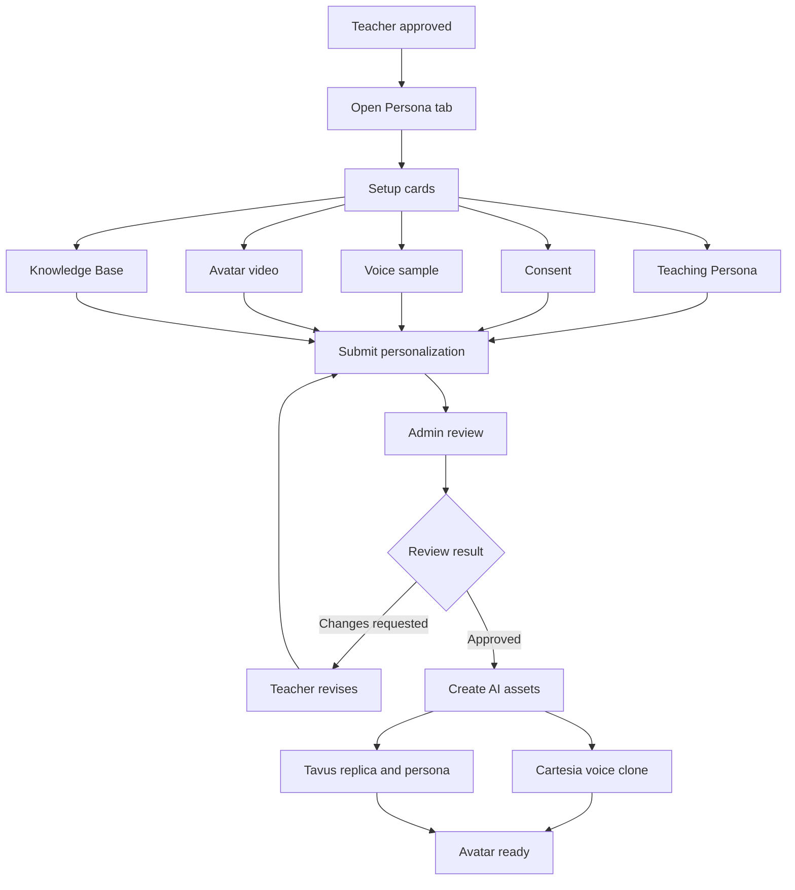
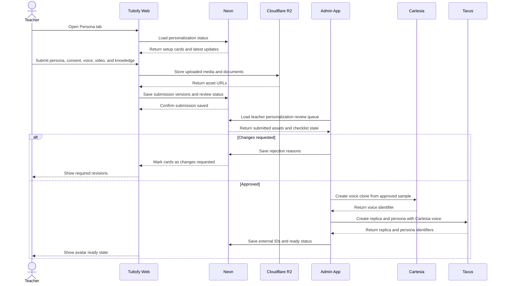

# Teacher Personalization

## Overview

Teacher personalization in Tuttofy defines the setup process after a teacher has been approved and is preparing to become an AI avatar tutor. This feature collects the teaching persona, consent, Cartesia voice sample, Tavus training video, and knowledge base content before everything is manually reviewed by an admin. After approval, Tuttofy can create or activate the AI assets used in learner-facing avatar sessions.

## Purpose

This feature exists to make sure a teacher avatar can do more than appear and speak. It must have an approved teaching style, voice, likeness, knowledge boundary, and media quality before learners interact with it. Manual review remains required because audio, video, consent, and knowledge quality need human judgment before assets are sent to Cartesia or Tavus.

## Users / Roles

- Teacher
- Admin reviewer
- Internal product team
- Internal engineering team
- Student as the end user of the active avatar

## Main Flow

1. The teacher completes onboarding and is approved as an active teacher.
2. Tuttofy opens the `Persona` tab in the teacher dashboard alongside other tabs such as `Dashboard` and `Course`.
3. Inside the `Persona` tab, the teacher sees setup cards for `Teaching Persona`, `Consent`, `Voice`, `Avatar Video`, and `Knowledge Base`.
4. The teacher completes the teaching persona questionnaire to define learning style, tone, teaching approach, subject scope, and response boundaries.
5. The teacher submits the required consent for likeness and voice usage.
6. The teacher records or uploads a voice sample that will be reviewed and then used to create a Cartesia voice clone.
7. The teacher records or uploads a training video that will be reviewed and then used to create a Tavus replica.
8. The teacher uploads knowledge base content such as PDFs or other supported documents depending on the enabled product scope.
9. After all required sections are submitted, the personalization status moves to `under_review`.
10. An admin opens the separate admin application to validate each section with a review checklist.
11. If any section is not acceptable, the admin sends `changes_requested` with a specific reason.
12. If all sections pass, Tuttofy creates or activates the Cartesia voice clone, Tavus replica and persona, and stores the required external IDs.
13. Once the AI assets are ready, teacher personalization moves to `ready` and can be used in avatar conversation sessions.

## Visual Flow

## Interaction Sequence

## Business Rules

- A teacher can only start teacher personalization after their teacher profile or teacher onboarding has been approved.
- The `Persona` tab in the teacher dashboard shows status cards for `Teaching Persona`, `Consent`, `Voice`, `Avatar Video`, and `Knowledge Base`.
- Each card must show status, latest update, latest version, and a primary action such as `Manage`, `Submit`, `Re-submit`, or `View`.
- The primary personalization lifecycle uses `draft`, `submitted`, `under_review`, `changes_requested`, `approved`, `creating_ai_assets`, `processing`, `ready`, `rejected`, and `disabled`.
- Each card uses `not_started`, `in_progress`, `submitted`, `approved`, `rejected`, `locked`, and `needs_update`.
- Manual review is required before Tuttofy creates a Cartesia voice clone or a Tavus replica/persona.
- After voice and video are approved, the teacher must not directly mutate the active assets. Changes must be handled as a new version or re-submission.
- After verification, the teacher may still update `Teaching Persona` and `Knowledge Base`, but significant changes can trigger review again.
- Consent must be stored as a separate section so likeness and voice usage audit history is not mixed into ordinary training video data.
- The voice sample is used for Cartesia voice cloning and TTS, not as a replacement for the Tavus replica video.
- The Tavus persona must use the Cartesia voice through TTS configuration such as `tts_engine: cartesia` and `external_voice_id`.
- The Tavus replica is still created from the training video or another visual asset based on the chosen training path.
- Knowledge base content must be reviewed for relevance, usage rights, data safety, and alignment with the approved subject scope.
- Students must not see or use the teacher avatar before personalization reaches `ready`.
- Internal preview or test conversation can live in the separate admin application and is not required inside the core Tuttofy web app.

## Review Requirements

### Teaching Persona

- Teaching style is clear, such as supportive, Socratic, direct, visual, or practice-based.
- Subject scope and audience level are clear.
- Tone and language match Tuttofy's brand.
- Response boundaries are clear so the avatar does not answer outside the teacher's competence.
- The prompt does not contain exaggerated claims or unrealistic learning outcome promises.

### Consent

- The teacher consents to using their voice and likeness for AI avatar creation.
- Consent can be verified and linked to the correct teacher.
- If using a Tavus training video, the consent statement must follow Tavus requirements or be provided as a separate consent video when the product flow uses that approach.

### Voice

- The voice sample must be clean, clear, and contain only the teacher's voice.
- There should be no dominant background noise, other speakers, music, or excessive echo.
- The sample should sound natural enough for cloning and should not include excessive silence.
- The Cartesia voice identifier is stored after cloning succeeds.
- If the voice clone sounds insufficiently similar or not production-ready, the status should move to `changes_requested` or `rejected`.

### Avatar Video

- The training video file follows Tavus requirements: `.mp4`, `h.264` encoding, under `750MB`, at least `1 minute`, and at least `25fps`.
- The optimal training video duration is around `1.5-2 minutes`.
- The video should include natural speech and can include a silent section according to Tavus quality guidance.
- The teacher must remain stable, face the camera, have a clearly visible face, be the only person in frame, and keep the camera at eye level.
- Lighting must be stable and even.
- The background must be clean and not distracting.
- The video must be one take, unedited, without cuts, and not AI-generated.
- The video's audio must be clean because Tavus can reject training if background noise or other voices are detected.

### Knowledge Base

- In the MVP, Tuttofy may limit knowledge base uploads to PDFs to simplify review.
- If expanded, Tavus Knowledge Base supports formats such as PDF, TXT, DOCX, DOC, PNG, JPG, PPTX, CSV, XLSX, and website URLs.
- Each document must have review status and can be enabled or disabled.
- Documents must be relevant to the teacher's subject scope and future courses.
- Documents must not contain sensitive data that should not be used in learner sessions.

## Data / Fields

- `teacher_personalization_id`
- `teacher_id`
- `personalization_status`
- `submitted_at`
- `reviewed_at`
- `reviewed_by_admin_id`
- `latest_update_at`
- `teaching_persona_id`
- `teaching_style`
- `tone`
- `primary_language`
- `subject_scope`
- `audience_level`
- `guardrails`
- `consent_status`
- `consent_asset_id`
- `voice_submission_id`
- `voice_status`
- `voice_asset_id`
- `cartesia_voice_id`
- `avatar_video_submission_id`
- `avatar_video_status`
- `avatar_video_asset_id`
- `tavus_replica_id`
- `tavus_persona_id`
- `knowledge_base_collection_id`
- `knowledge_document_ids[]`
- `tavus_document_ids[]`
- `card_status`
- `card_latest_update_at`
- `review_checklist`
- `review_notes`
- `rejection_reason`
- `version`
- `locked_at`

## Edge Cases

- The teacher is approved but has not opened the `Persona` tab yet.
- The teacher submits some cards but has not completed all required sections.
- The teacher uploads clean voice audio, but the Cartesia clone is not similar enough.
- The teacher uploads a correctly formatted video, but Tavus fails it because of excessive movement, poor lighting, or a face that is too small in frame.
- Consent does not match the teacher name or cannot be verified.
- Admin approves the persona but rejects the voice or video.
- Cartesia creates the voice clone successfully, but Tavus persona creation fails.
- Tavus replica training can take several hours, so processing status must stay informative.
- Knowledge base upload succeeds but Tavus document processing fails.
- The teacher updates the knowledge base after the avatar is ready, requiring review for new documents without disabling all already approved assets.
- The teacher requests a video re-record after the avatar is active, so the system must create a new version without breaking the active replica.
- The admin app is unavailable, so teacher submissions remain saved but review is delayed.

## Related Features

- Tech Stack
- Onboarding
- Teacher profile
- Course creation
- Upload learning material
- Guardrails and knowledge scope
- Avatar conversation session
- Admin management

## Notes

- This document focuses on teacher avatar setup before learners use the avatar, not on the student learning experience after joining a course.
- Cartesia is used for voice cloning and TTS. Tavus is used for replica, persona, knowledge attachment, and live avatar conversation.
- For private Cartesia voices, the API key must be stored on the backend and must not be exposed to the client.
- Tavus and Cartesia requirements should be checked against official documentation before final API implementation because provider details can change.
- Initial references: Tavus persona TTS supports Cartesia through `external_voice_id`, Tavus replica training has strict video requirements, and Cartesia provides voice cloning through the Playground and API.
