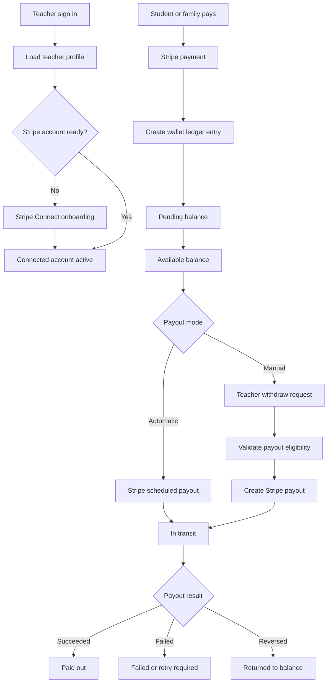
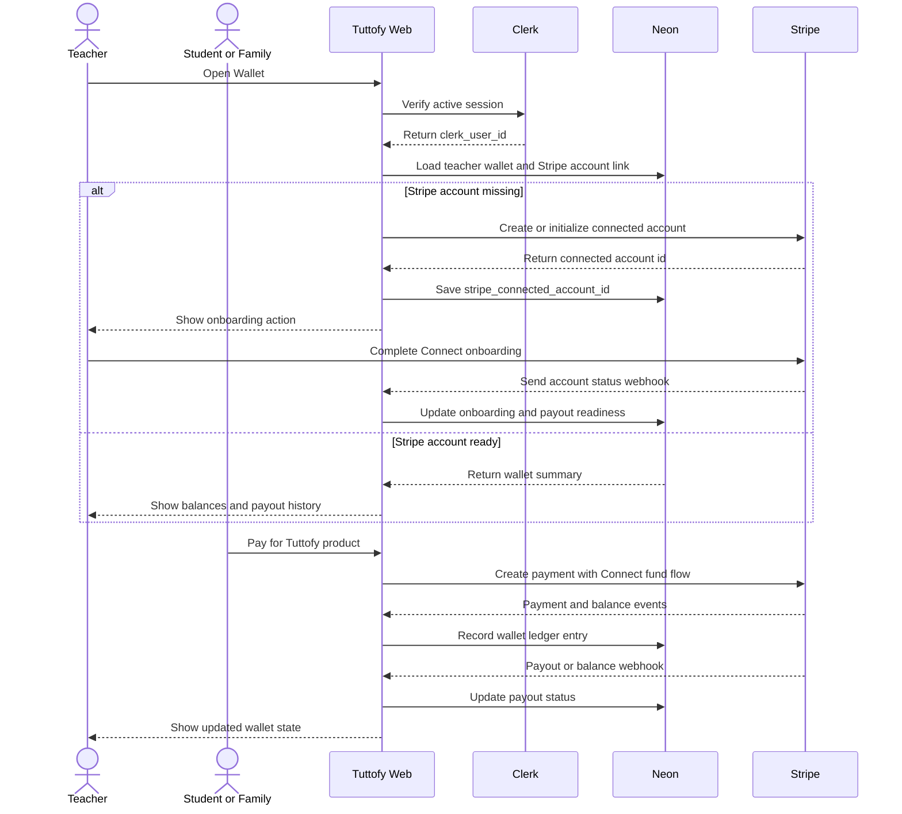

# Teacher Wallet

## Overview

Teacher wallet in Tuttofy is the dashboard area that shows teacher earnings, balance states, and payout history based on Stripe Connect. The wallet is not a separate money store outside Stripe. Tuttofy stores the product ledger and wallet state in Neon, while fund movement, Stripe balances, connected account onboarding, payout accounts, and payouts to teachers are handled through Stripe.

## Goal

This feature gives teachers clear visibility into earnings that are still processing, balances that are available for payout, and payouts that have already started or completed. Because Tuttofy's teacher revenue model is still being planned, this document defines the wallet foundation, balance states, and Stripe integration boundaries without locking the final revenue share formula.

## Users / Roles

- Teacher
- Student or family payer as the payment source
- Finance or operations admin
- Internal product team
- Internal engineering team
- Stripe as payment and payout provider
- Clerk as identity provider

## Main Flow

1. The teacher signs in to Tuttofy through Clerk.
2. Tuttofy reads the `clerk_user_id`, then loads the teacher profile and internal wallet record from Neon.
3. If the teacher does not yet have a Stripe connected account, Tuttofy creates or initializes one through Stripe Connect.
4. The teacher completes Stripe onboarding for identity verification, payout requirements, and a supported payout account such as a bank account.
5. Tuttofy stores the `stripe_connected_account_id` in the internal teacher/wallet record, and may store a non-public reference in Clerk private metadata when useful for backend lookup.
6. When a student or family payer pays, Stripe processes the payment through the Tuttofy platform.
7. Tuttofy calculates or marks the teacher's potential share as a wallet ledger entry based on the revenue rule active for that transaction.
8. While the funds are not yet safe or settled, the wallet shows the amount as `pending`.
9. After the funds are available according to Stripe and Tuttofy rules, the wallet shows the teacher share as `available`.
10. Payouts can run automatically based on a Stripe schedule or manually through a `Withdraw` action, depending on the product decision.
11. When a payout is created, the wallet shows the status as `in_transit`.
12. After the payout succeeds, the wallet records `paid_out` and shows the payout in history.
13. If a payout fails, or if a refund, dispute, or negative balance occurs, the wallet updates the relevant ledger and status.

## Visual Diagram

## Interaction Sequence

## Business Rules

- `Clerk` is the source of truth for teacher identity and sessions.
- `Neon` is the source of truth for teacher profiles, wallet ledger entries, product payout status, and the mapping between `teacher_id`, `clerk_user_id`, and `stripe_connected_account_id`.
- `Stripe` is the source of truth for payments, connected accounts, Stripe balances, payout accounts, payout objects, and settlement state.
- Teacher wallet must not promise funds as `available` before those funds meet Stripe availability and Tuttofy internal rules.
- Wallet must separate at least the balance states `pending`, `available`, `in_transit`, `paid_out`, `failed`, `reversed`, `held`, and `adjusted`.
- Teacher income is not finalized in this documentation phase. The revenue share formula must become a separate configuration or business rule before production payouts are enabled.
- For a new platform integration, Stripe Connect should be designed with Accounts v2 and configuration/controller responsibilities, not by relying on legacy account type terminology.
- The recommended MVP payout mode is automatic payout or admin-controlled payout. Manual `Withdraw` can be added after minimum payout, hold period, fee, and support rules are ready.
- If manual withdrawal is enabled, teachers can only withdraw `available` balance, not `pending` balance.
- Tuttofy may hold part of the funds as reserve for refunds, disputes, chargebacks, fraud review, or policy review.
- Refunds, disputes, or adjustments after a ledger entry is created must create correction ledger entries instead of deleting the original transaction history.
- A teacher who has not completed Stripe onboarding cannot receive payouts even if the internal ledger already has pending earnings.
- A teacher whose Stripe account is `restricted`, `requirements_due`, or payout-disabled must see a clear status and a next action for completing onboarding.
- Payout account details should be collected through Stripe-hosted or embedded onboarding where possible so Tuttofy does not directly store sensitive bank details.
- Tuttofy's company is based in Singapore. Payout availability to teachers in other countries still depends on Stripe Connect eligibility, cross-border payouts, connected account country, currency, and local requirements.
- If a teacher is in a country that is not supported for the required connected account or payout flow, the wallet must show a not-eligible state and route the case to manual review.
- Payout schedules, settlement timing, and fees can vary by country, currency, payment method, and Stripe configuration.

## Balance Model

- `pending`: earnings are recorded from a transaction but are not yet available for payout.
- `available`: earnings meet Stripe and Tuttofy rules for payout.
- `in_transit`: a payout has been created and is being sent to the teacher's payout account.
- `paid_out`: the payout was successfully sent.
- `failed`: the payout failed and needs retry or payout method correction.
- `reversed`: the payout was reversed or funds returned to the balance.
- `held`: funds are intentionally held because of review, refund windows, disputes, or internal policy.
- `adjusted`: a ledger correction caused by refund, dispute, calculation error, fee, or policy change.

## Payout Model

### Automatic Payouts

Automatic payouts let teachers receive funds based on a Stripe schedule or a schedule configured by the platform. This model is simpler for MVP because teachers do not need to request withdrawals, but Tuttofy still needs to show estimated payout dates and payout history.

### Manual Withdrawal

Manual withdrawal lets teachers press `Withdraw` from the wallet. Tuttofy must validate available balance, minimum payout, account readiness, holds, and refund/dispute risk before creating a payout through Stripe. This model gives teachers more control, but it requires more mature finance and support rules.

## Data / Fields

- `teacher_wallet_id`
- `teacher_id`
- `clerk_user_id`
- `stripe_connected_account_id`
- `stripe_account_status`
- `stripe_requirements_status`
- `payouts_enabled`
- `charges_enabled`
- `default_currency`
- `wallet_status`
- `pending_balance`
- `available_balance`
- `held_balance`
- `lifetime_earnings`
- `lifetime_paid_out`
- `wallet_ledger_entry_id`
- `ledger_entry_type`
- `ledger_entry_status`
- `gross_amount`
- `platform_fee_amount`
- `stripe_fee_amount`
- `teacher_share_amount`
- `currency`
- `source_payment_id`
- `source_course_id`
- `source_enrollment_id`
- `source_payer_context`
- `available_on`
- `hold_until`
- `payout_id`
- `payout_status`
- `payout_arrival_date`
- `payout_failure_code`
- `payout_failure_message`
- `manual_withdrawal_requested_at`
- `reviewed_by_admin_id`
- `created_at`
- `updated_at`

## Edge Cases

- The teacher has a Clerk account and teacher profile, but no Stripe connected account yet.
- The teacher creates a connected account but has not completed onboarding.
- Stripe requests additional requirements after the teacher was previously active.
- The teacher changes country, legal entity, or payout account and the account needs review again.
- The teacher is in a country that is not eligible for payout from a Singapore platform.
- Payment succeeds but transfer or teacher earning recording is delayed.
- Payment arrives in a currency that differs from the teacher payout currency.
- Funds remain pending because of settlement timing or risk review.
- A refund occurs after teacher earnings have already been recorded.
- A dispute or chargeback creates a negative teacher balance or requires a reserve.
- Payout fails because the bank account is wrong, the account is closed, or Stripe requirements changed.
- Payout is `in_transit` but the bank takes extra time to finish the deposit.
- Stripe webhooks are delayed, replayed, or received out of order.
- Internal ledger and Stripe events are temporarily out of sync and require a reconciliation job.
- Manual withdrawal is clicked multiple times, requiring idempotency and locking.
- Admin holds a teacher payout because of policy review or suspected abuse.

## Related Features

- Tech Stack
- Authentication
- Onboarding
- Teacher profile
- Teacher personalization
- Course discovery and join
- Course learning experience
- Family account
- Payment or subscription
- Admin management

## Notes

- For course payments or subscriptions that involve teacher payouts, Stripe Connect is more appropriate than plain Stripe Checkout because funds must be linked to teacher connected accounts.
- Destination charges are a good starting point if Tuttofy as the platform accepts payment and routes the teacher share to the connected account.
- Separate charges and transfers can be considered if one payment needs to be split across multiple teachers or if the revenue share model needs delayed allocation.
- This document intentionally does not define teacher share percentage, minimum payout, fee policy, or tax handling because those decisions depend on the business model.
- Before production, the team must validate Stripe Connect and cross-border payout availability for the combination of Singapore platform country, teacher country, payer country, and currency.
