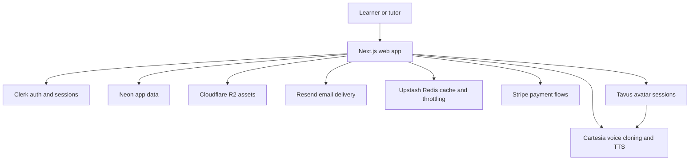
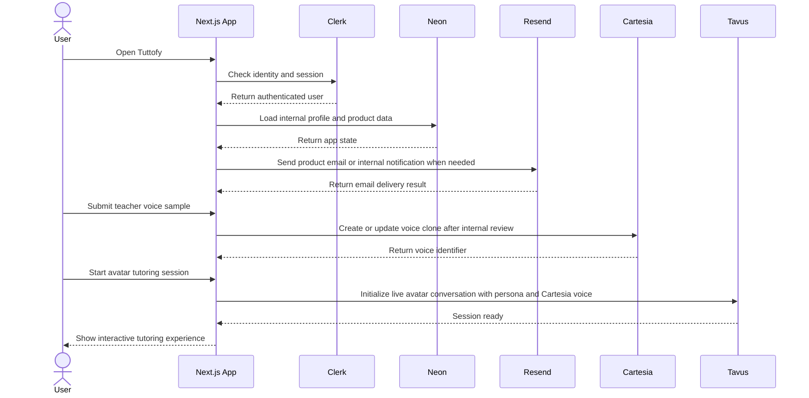

# Tech Stack

## Overview

Tuttofy core web app uses a modern managed stack so the team can focus on tutor and learner product behavior instead of rebuilding commodity infrastructure. Each service has a clear product-facing responsibility and should be documented according to the role it plays in the Tuttofy experience.

## Purpose

This page explains the current high-level technology stack used by Tuttofy, the responsibility of each service, and the product boundaries between them. It is intended to keep product, design, and engineering aligned without going into low-level infrastructure detail.

## Users / Roles

- Internal product team
- Design team
- Engineering team
- Founders or operators who need a shared system overview

## Main Flow

1. A learner or tutor opens the Tuttofy core web app built with Next.js.
2. Authentication, identity verification, and session handling are managed through Clerk.
3. After a user is recognized, Tuttofy reads or creates the corresponding internal profile and product data in Neon.
4. If the user accesses learning materials or uploaded assets, Tuttofy uses Cloudflare R2 as object storage.
5. If the product needs to send transactional emails or internal notifications such as a new teacher onboarding alert, Tuttofy uses Resend as the email sender.
6. If the product requires payment or subscription transactions in its active phase, Tuttofy uses Stripe as the payment provider.
7. If the product needs cache, throttling, or fast ephemeral coordination, Tuttofy uses Upstash Redis.
8. After a teacher is approved and starts avatar setup, Tuttofy collects persona, consent, training video, voice sample, and knowledge base content for human review before creating AI assets.
9. For the teacher's voice, Tuttofy uses Cartesia as the voice cloning and TTS provider, then stores the voice reference that can be attached to a Tavus persona.
10. When a learner starts an avatar tutoring experience, Tuttofy coordinates the product flow while Tavus powers the live avatar conversation layer.

## Visual Flow

## Interaction Sequence

## Business Rules

- `Next.js` is the framework for the core Tuttofy web app, including routing, rendering, and custom UI flows.
- `Clerk` is the source of truth for identity, authentication, verification state, and active user sessions.
- `Neon` is the source of truth for internal application data after a user has been identified by Clerk.
- `Resend` is used for outbound email delivery such as transactional email or internal notifications, but it does not own review state or application business data.
- `Tavus` is responsible for live avatar tutoring conversations, not for Tuttofy user identity or application data ownership.
- `Cartesia` is used for teacher avatar voice cloning and text-to-speech. Cartesia voices are attached to Tavus through persona TTS configuration such as `tts_engine: cartesia` and `external_voice_id`.
- `Upstash Redis` is reserved for app support needs such as caching, rate limiting, or lightweight coordination data.
- `Cloudflare R2` stores product files and objects such as learning materials or downloadable assets.
- `Stripe` is used as the payment provider for payment, billing, or subscription transaction flows when those features are active.
- Internal admin access is out of scope for the Tuttofy core web app because the admin system lives in a separate application.
- Teacher voice samples, training videos, consent, persona, and knowledge base content must pass manual review before Tuttofy creates or activates assets in Cartesia and Tavus.
- After a voice clone or replica is approved, audio/video changes should be handled as a new version or re-submission instead of mutating the active asset directly.

## Data / Fields

- `stack_component`
- `service_name`
- `responsibility`
- `product_boundary`
- `owns_identity`
- `owns_app_data`
- `owns_files`
- `owns_email_delivery`
- `owns_payment_flow`
- `owns_voice_clone`
- `owns_avatar_session`
- `integration_notes`

## Edge Cases

- If Clerk is available but Neon does not yet have a matching internal user record, Tuttofy should create or complete that record during onboarding or first-login sync.
- If teacher onboarding is saved successfully in Neon but Resend fails to send the admin notification email, the onboarding state should remain saved and the notification can be retried without losing core data.
- If Tavus is unavailable, avatar conversation sessions are impacted, but identity, profiles, and core product data remain owned by Tuttofy systems.
- If Cartesia is unavailable, teacher voice clone creation or usage may be delayed, but persona, video, knowledge base review, and application data can continue in Tuttofy.
- If Cartesia voice cloning fails or the result does not meet quality standards, the teacher voice status should move to `changes_requested` or `rejected` without activating the persona/avatar for learners.
- If a Cartesia voice identifier changes after re-cloning, the Tavus persona using that voice must be updated to reference the latest `external_voice_id`.
- If R2 is temporarily unavailable, uploaded or downloadable learning assets may fail even if the rest of the app remains accessible.
- If Stripe is unavailable, payment or subscription flows cannot be completed even if other areas of the product remain accessible.
- If Upstash Redis is degraded, cache-backed or throttling-related features may behave differently without changing the core identity model.

## Related Features

- Authentication
- Onboarding
- User profile
- Teacher profile
- Upload learning material
- Teacher personalization
- Voice cloning
- Payment or subscription
- Avatar conversation session
- Random conversation session

## Notes

- The current stack for Tuttofy core web is `Next.js`, `Clerk`, `Neon`, `Cloudflare R2`, `Resend`, `Upstash Redis`, `Stripe`, `Cartesia`, and `Tavus`.
- Tuttofy uses custom auth UI in Next.js even though authentication lifecycle behavior is managed by Clerk.
- Tavus supports Cartesia in the persona TTS layer. For custom/private voices, Tuttofy should keep the Cartesia API key on the backend and send the voice identifier as `external_voice_id` when creating or updating a Tavus persona.
- This page intentionally describes service responsibilities at a product level and avoids infrastructure implementation details.
