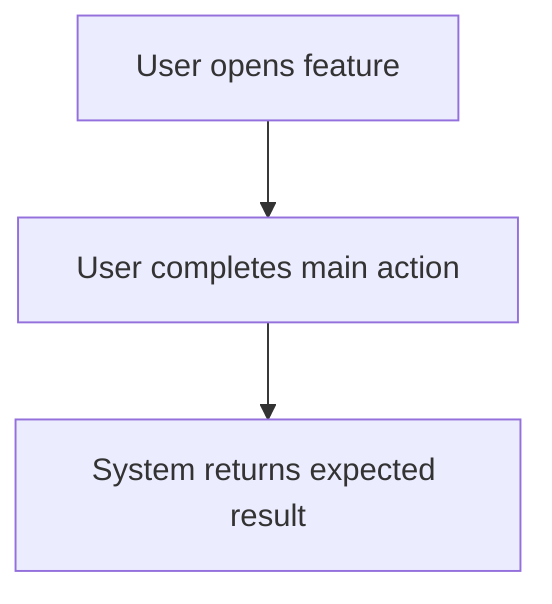
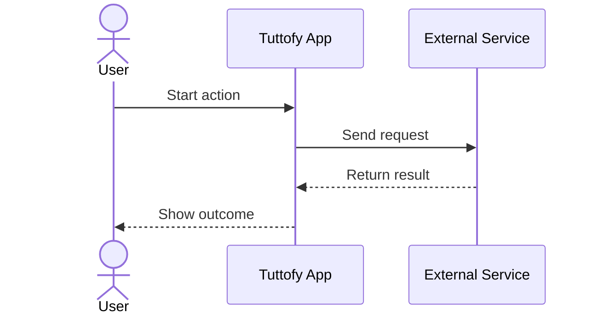

# Feature Name

## Overview

Describe what the feature is in one short paragraph. Focus on the product behavior and where this feature appears in the Tuttofy experience.

## Purpose

Explain why the feature exists, what problem it solves, and what outcome it supports for the business or the learner/tutor journey.

## Users / Roles

List the roles that interact with this feature. Use product terms such as learner, tutor, admin, or internal team when relevant.

## Main Flow

Describe the primary step-by-step flow for using the feature. Keep the flow practical and sequential so a reader can understand how the feature behaves from start to finish.

## Visual Flow

Add at least one Mermaid diagram for every document. Use a `flowchart` to summarize the primary product journey, screen transitions, or decision points.

## Interaction Sequence

If the feature involves multi-step interaction between a user and one or more systems, add a Mermaid `sequenceDiagram`. This section is strongly recommended for authentication, onboarding, integrations, uploads, approvals, and any API-backed flow.

## Business Rules

List the important rules, limitations, permissions, validations, or guardrails that define how the feature is allowed to work.

## Data / Fields

List the key data points used by the feature. Include only product-relevant fields such as title, status, owner, content type, visibility, or progress state.

## Edge Cases

Describe unusual scenarios, errors, empty states, permission issues, or failure cases that should be considered when defining the feature.

## Related Features

List the connected features or dependencies that should be referenced when someone reads this page.

## Notes

Add concise product or light technical notes that help internal teams align on implementation context, dependencies, or future considerations.
