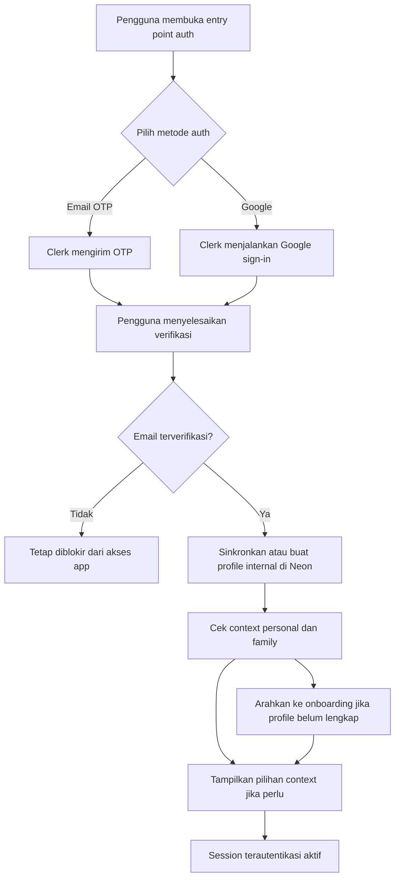
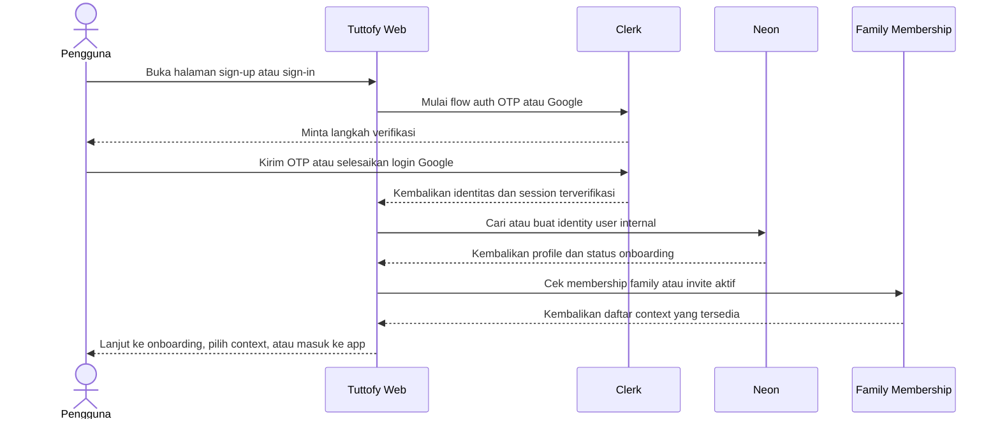

# Authentication

## Gambaran Umum

Authentication di Tuttofy core web mengatur bagaimana pembelajar, tutor, dan anggota family membuat akun, memverifikasi identitas, memulai session, lalu masuk ke context produk yang tepat dengan aman. Tuttofy menggunakan Clerk sebagai provider autentikasi penuh sambil tetap memakai custom auth UI di Next.js untuk pengalaman produk.

## Tujuan

Fitur ini ada untuk memastikan hanya pengguna terverifikasi yang dapat mengakses produk inti Tuttofy, bahwa identitas dikelola secara konsisten di antara metode login email dan Google, dan bahwa profile aplikasi internal, membership family, serta context belajar dapat dihubungkan ke record user yang andal sebelum onboarding atau akses produk dimulai.

## Pengguna / Peran

- Pembelajar
- Tutor
- Anggota family account
- Tim product dan engineering internal yang bergantung pada model identitas

## Alur Utama

1. Pengguna baru membuka entry point sign-up bersama di Tuttofy core web app.
2. Pengguna memilih metode autentikasi `passwordless email OTP` atau `Google`.
3. Jika pengguna memakai email OTP, Clerk mengirim kode verifikasi ke email pengguna dan pengguna memasukkan kode itu di custom auth UI milik Tuttofy.
4. Jika pengguna memakai Google, Clerk menyelesaikan alur sign-in Google dan mengembalikan identitas yang telah diautentikasi ke Tuttofy.
5. Tuttofy mewajibkan email terverifikasi sebelum memberikan akses ke aplikasi.
6. Setelah first verified sign-in berhasil, Tuttofy membuat atau melengkapi record user internal di Neon jika masih dibutuhkan.
7. Tuttofy memeriksa apakah email pengguna memiliki membership family, undangan family yang masih aktif, atau context personal yang sudah ada.
8. Jika pengguna belum memiliki profile internal lengkap, pengguna diarahkan ke onboarding sebelum memakai pengalaman produk utama.
9. Jika pengguna memiliki lebih dari satu context seperti `personal` dan `family`, Tuttofy menampilkan pemilihan context atau `switch to family` sebelum pengguna masuk ke area aplikasi yang sesuai.
10. Pada kunjungan berikutnya, pengguna yang sama dapat sign in lagi dengan email OTP atau Google dan Clerk memulihkan session aktifnya.
11. Saat pengguna sign out, Clerk mengakhiri session dan Tuttofy mengembalikan pengguna ke status belum terautentikasi.

## Diagram Visual

## Sequence Interaksi

## Aturan Bisnis

- `Clerk` sepenuhnya menangani sign-up, sign-in, verification, dan lifecycle session untuk Tuttofy core web app.
- Tuttofy menggunakan layar autentikasi kustom di `Next.js`, bukan halaman hosted default dari Clerk.
- Metode autentikasi yang diizinkan pada fase ini hanya `passwordless email OTP` dan `Google`.
- `Google` adalah satu-satunya social provider yang didukung pada fase ini.
- Pengguna harus menyelesaikan verifikasi email sebelum dapat mengakses aplikasi.
- Satu email terverifikasi merepresentasikan satu identitas akun meskipun pengguna yang sama sign in melalui email OTP dan Google.
- Satu identitas dapat memiliki beberapa context produk seperti `personal` dan `family`.
- Family membership berada di domain aplikasi Tuttofy, bukan di domain identitas Clerk.
- Email yang sudah pernah terdaftar tetap dapat menerima invite ke family account.
- Jika email invite sudah memiliki akun aktif, pengguna tidak membuat akun baru dan cukup menambahkan membership family pada identitas yang sama.
- Billing family hanya melekat pada `family owner`, tetapi aturan billing detail didokumentasikan di fitur `family-account`, bukan di halaman auth ini.
- `Clerk` adalah source of truth untuk identitas dan status autentikasi.
- `Neon` adalah source of truth untuk data aplikasi internal, membership family, dan context pengguna setelah pengguna dikenali oleh Clerk.
- `clerk_user_id` adalah penghubung utama antara identitas Clerk dan record internal Tuttofy.
- Onboarding baru dimulai setelah first verified sign-in berhasil.
- Authentication hanya menetapkan siapa pengguna dan context mana yang sedang aktif, bukan menentukan learning path atau enrollment course.
- Authentication untuk admin berada di luar cakupan flow ini karena sistem admin berada di aplikasi terpisah.
- Perilaku auth untuk payment atau subscription berada di luar cakupan fase ini.

## Data / Field

- `clerk_user_id`
- `primary_email`
- `email_verification_status`
- `auth_provider`
- `connected_providers`
- `session_status`
- `available_contexts[]`
- `active_context`
- `family_membership_status`
- `pending_family_invites[]`
- `onboarding_status`
- `internal_user_profile_id`

## Edge Cases

- OTP yang dimasukkan salah.
- OTP sudah kedaluwarsa dan pengguna perlu meminta kode baru.
- Email sudah terhubung dengan akun yang sudah ada.
- Pengguna sign in dengan Google memakai email terverifikasi yang sebelumnya sudah dipakai untuk email OTP.
- Pengguna menerima invite family pada email yang belum pernah terdaftar lalu menyelesaikan sign-up.
- Pengguna menerima invite family pada email yang sudah memiliki akun lalu harus melihat opsi `switch to family`.
- Clerk berhasil mengautentikasi pengguna tetapi Neon belum memiliki record user atau profile internal yang sesuai.
- Pengguna mencoba mengakses aplikasi sebelum verifikasi email selesai.
- Pengguna sign out di tengah onboarding lalu kembali lagi untuk melanjutkan setup yang tersisa.
- Pengguna memiliki lebih dari satu context aktif dan perlu memilih context yang benar sebelum masuk ke produk.

## Fitur Terkait

- Onboarding
- Family account
- User profile
- Teacher profile
- Join course
- Tech Stack

## Catatan

- Password-based local authentication tidak termasuk dalam cakupan Tuttofy core web saat ini.
- Akun tutor, pembelajar, dan anggota family memakai entry point autentikasi yang sama, lalu bercabang belakangan melalui onboarding, membership context, status profile, atau izin akses.
- Cakupan dokumentasi saat ini tidak mencakup login admin internal, social provider selain Google, atau flow payment dan subscription.
