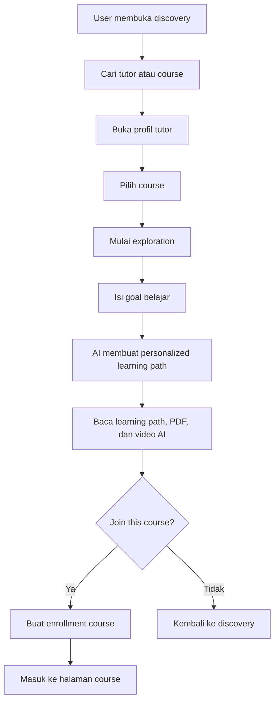
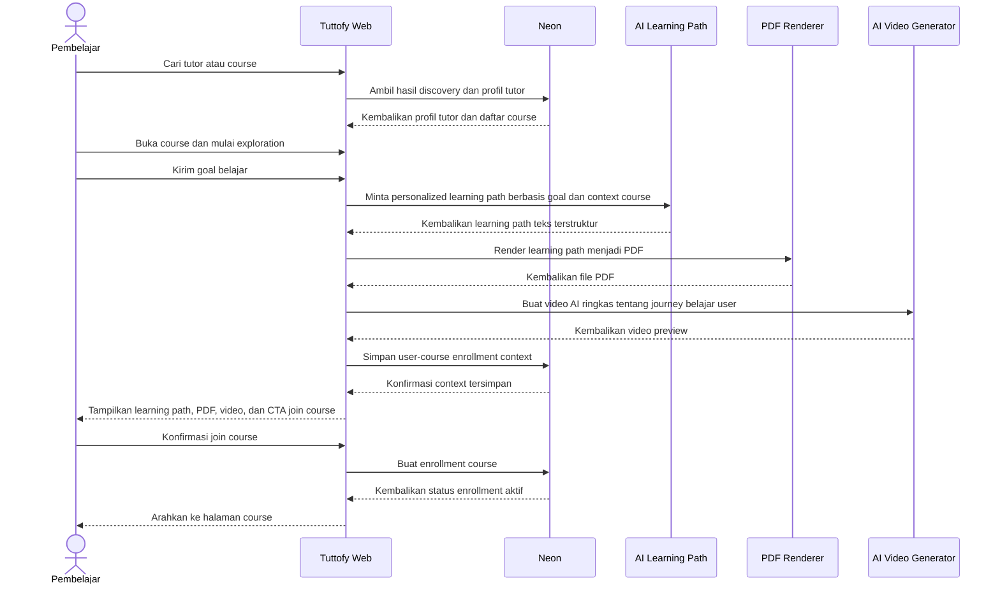

# Course Discovery and Join

## Gambaran Umum

Course discovery and join di Tuttofy mengatur bagaimana pembelajar menemukan tutor, meninjau profil tutor, memilih course, menjalani tahap `exploration`, menerima `personalized learning path`, lalu memutuskan apakah ingin bergabung ke course tersebut. Fitur ini menjadi gerbang onboarding akademik per course dan memastikan setiap enrollment dimulai dari goal belajar yang jelas.

## Tujuan

Fitur ini ada untuk membantu pembelajar menemukan course yang relevan, memahami siapa tutornya, dan mendapatkan pengalaman personal sejak sebelum join. Exploration dan learning path berfungsi untuk meningkatkan keyakinan user terhadap course, memperjelas arah belajar, serta memberi Tuttofy konteks resmi yang dapat dipakai untuk personalisasi pembelajaran berikutnya.

## Pengguna / Peran

- Student
- Parent
- Child
- Tutor
- Tim product dan engineering internal

## Alur Utama

1. Pembelajar membuka area discovery setelah onboarding selesai.
2. Pembelajar mencari tutor atau course berdasarkan topik, kebutuhan belajar, atau filter yang tersedia.
3. Pembelajar membuka profil tutor untuk melihat `about the teacher`, `experience`, `certificates`, dan daftar course yang dibuat tutor.
4. Pembelajar memilih satu course yang ingin dipelajari.
5. Sebelum join course, pembelajar wajib menekan tombol `Exploration`.
6. Pada tahap exploration, pembelajar menuliskan goal belajar pada textarea.
7. AI memproses goal pengguna bersama context tutor dan course, lalu menghasilkan `personalized learning path`.
8. Tuttofy menyimpan hasil learning path sebagai data teks terstruktur dan juga merender file `PDF` agar dapat diunduh.
9. Tuttofy menampilkan learning path kepada pembelajar untuk dibaca, menyediakan tombol download PDF, dan menampilkan video AI yang menjelaskan perjalanan belajar yang akan dilalui jika memakai course tersebut.
10. Setelah pembelajar meninjau hasil exploration, sistem menampilkan pertanyaan `Join this course?`
11. Jika pembelajar setuju, sistem membuat enrollment pada course dan menghubungkan user ke `user-course enrollment context` yang berisi learning path tersebut.
12. Setelah join, pembelajar dapat masuk ke halaman course dan memilih mode belajar yang tersedia di dalam course.

## Diagram Visual

## Sequence Interaksi

## Aturan Bisnis

- Search, teacher profile review, exploration, learning path, dan join course diperlakukan sebagai satu rangkaian fitur discovery-to-enrollment.
- Pembelajar harus dapat melihat profil tutor sebelum memulai exploration.
- Informasi minimal pada profil tutor meliputi `about the teacher`, `experience`, `certificates`, dan daftar course.
- `Exploration` wajib diselesaikan sebelum user bisa join course.
- Satu enrollment course harus memiliki satu `user-course enrollment context` aktif.
- Learning path disimpan dalam bentuk teks atau data terstruktur untuk kebutuhan sistem internal.
- Learning path juga harus tersedia dalam bentuk file `PDF` yang bisa diunduh user.
- Video AI bersifat bagian dari pengalaman exploration dan menjelaskan perjalanan belajar user untuk course tersebut.
- `Join course` hanya tersedia setelah learning path, PDF, dan video AI selesai dipersiapkan atau cukup siap ditampilkan.
- Jika user menolak join setelah exploration selesai, learning path tetap dapat disimpan sebagai draft context atau preview context sesuai keputusan implementasi produk.
- Exploration tidak boleh otomatis membuat akses ke module atau free conversation sebelum enrollment course aktif.
- Scope learning path harus tetap berada dalam batas teacher profile, course goal, dan knowledge scope yang valid.

## Data / Field

- `teacher_profile_id`
- `teacher_about`
- `teacher_experience`
- `teacher_certificates[]`
- `course_id`
- `course_title`
- `course_description`
- `course_scope`
- `course_guardrails`
- `exploration_goal_text`
- `learning_path_id`
- `learning_path_text`
- `learning_path_structured_data`
- `learning_path_pdf_url`
- `learning_path_video_url`
- `learning_path_status`
- `course_enrollment_id`
- `course_enrollment_status`
- `user_course_context_id`
- `joined_at`

## Edge Cases

- Tidak ada hasil course yang cocok dengan pencarian user.
- Profil tutor tersedia tetapi tutor belum memiliki course aktif.
- User membuka course tetapi belum siap mengisi goal exploration.
- AI gagal membuat learning path setelah goal dikirim.
- PDF gagal dirender walaupun learning path teks berhasil dibuat.
- Video AI gagal dibuat walaupun learning path dan PDF berhasil.
- User menutup halaman setelah learning path dibuat tetapi sebelum join course.
- User mencoba membuka course langsung tanpa menyelesaikan exploration.
- User melakukan exploration ulang untuk course yang sama setelah sebelumnya sudah join.
- Goal user terlalu luas atau di luar scope course sehingga AI harus tetap membatasi output.

## Fitur Terkait

- Authentication
- Onboarding
- Family account
- Teacher profile
- Course learning experience

## Catatan

- Dokumen ini menggabungkan `search course`, `teacher profile review`, `exploration`, `learning path`, dan `join course` agar satu alur pre-enrollment terdokumentasi utuh.
- Detail ranking search, SEO, atau rekomendasi discovery dapat diperluas pada fase berikutnya tanpa mengubah fondasi alur ini.
