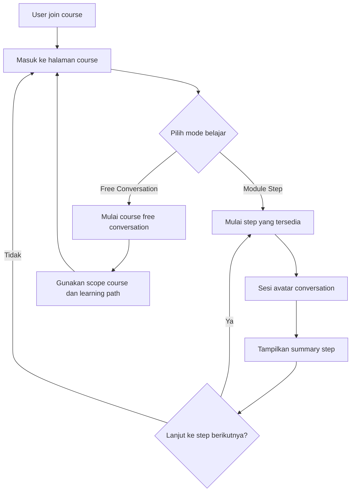
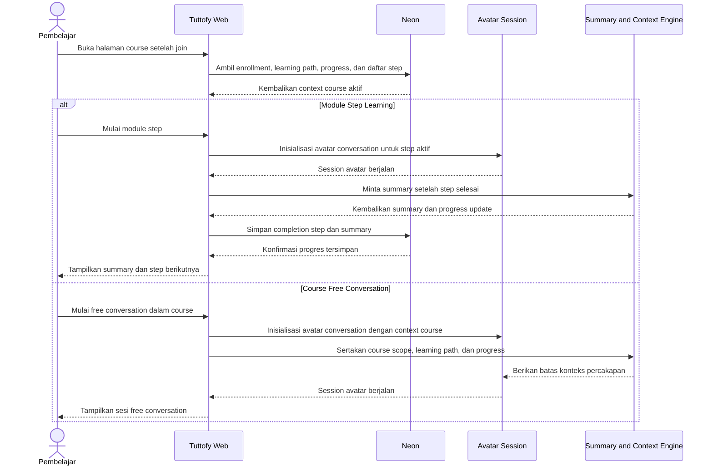

# Course Learning Experience

## Gambaran Umum

Course learning experience di Tuttofy mengatur pengalaman belajar pembelajar setelah resmi join ke sebuah course. Fitur ini mencakup jalur belajar terstruktur melalui `module step` atau `milestone`, mode `course free conversation`, materi belajar opsional, serta `summary` setelah setiap step selesai. Seluruh pengalaman ini dijalankan dengan context course dan `user-course enrollment context` yang telah dibentuk saat exploration.

## Tujuan

Fitur ini ada untuk memastikan pembelajar memiliki pengalaman belajar yang jelas setelah join course, baik saat mengikuti kurikulum berurutan maupun saat ingin bertanya lebih fleksibel. Tuttofy perlu menjaga agar pembelajaran tetap personal, relevan, dan berada dalam batas scope course sambil memberi tutor ruang untuk menyusun perjalanan belajar yang runtut.

## Pengguna / Peran

- Student
- Parent
- Child
- Tutor
- Tim product dan engineering internal

## Alur Utama

1. Pembelajar menyelesaikan exploration dan join ke course.
2. Tuttofy membuka halaman utama course berdasarkan enrollment aktif dan `user-course enrollment context`.
3. Di dalam course, pembelajar melihat daftar `module step` atau `milestone` yang disusun tutor secara berurutan.
4. Pembelajar dapat memulai step pertama yang tersedia.
5. Setiap step dijalankan sebagai sesi `virtual conversation with avatar`.
6. Jika tutor menyediakan materi belajar atau file unduhan, pembelajar dapat membukanya pada step yang relevan.
7. Setelah step selesai, Tuttofy menghasilkan `summary` yang merangkum apa yang dipelajari, progres user, dan kesiapan menuju step berikutnya.
8. Jika step berikutnya sudah terbuka, pembelajar dapat melanjutkan secara berurutan.
9. Selain mengikuti step terstruktur, pembelajar juga dapat membuka `course free conversation`.
10. Dalam free conversation, AI tetap dibatasi oleh scope course, guardrail course, learning path user, dan progress yang sudah dicapai di course tersebut.

## Diagram Visual

## Sequence Interaksi

## Aturan Bisnis

- Semua pengalaman belajar setelah enrollment aktif harus berjalan di level `course`, bukan level tutor umum.
- Tutor membuat `course` terlebih dahulu lalu menyusun `module step` atau `milestone` di dalamnya.
- Setiap `module step` adalah satu sesi belajar avatar yang terstruktur.
- Pembelajar mengikuti step secara berurutan sesuai urutan yang ditetapkan tutor, kecuali produk di masa depan mendukung unlock rule yang lebih fleksibel.
- Setelah satu step selesai, sistem harus menghasilkan `summary`.
- Summary perlu merangkum hasil belajar, progres, dan pengantar menuju langkah berikutnya.
- Materi belajar pada step bersifat opsional.
- `Course free conversation` selalu tersedia di level course, bukan di level tutor global.
- Free conversation harus dibatasi oleh `course scope`, `course guardrails`, `user-course enrollment context`, dan `student progress`.
- Pembelajar tidak boleh mengakses module atau free conversation sebelum enrollment course aktif.
- Jika tutor belum membuat module step, pembelajar tetap dapat memakai course free conversation selama course tersebut memang terbuka untuk enrollment.

## Data / Field

- `course_id`
- `course_title`
- `course_scope`
- `course_guardrails`
- `course_enrollment_id`
- `user_course_context_id`
- `learning_path_id`
- `module_step_id`
- `module_step_title`
- `module_step_order`
- `module_step_status`
- `module_step_materials[]`
- `avatar_session_id`
- `step_completed_at`
- `step_summary_text`
- `step_summary_status`
- `course_progress_percent`
- `next_available_step_id`
- `free_conversation_session_id`

## Edge Cases

- User join course tetapi tutor belum membuat satu pun module step.
- User berhenti di tengah sesi avatar step dan kembali lagi nanti.
- Summary gagal dibuat walaupun step dianggap selesai.
- Tutor memperbarui urutan step saat ada student yang sudah sedang belajar.
- Materi unduhan rusak atau tidak bisa dibuka.
- User mencoba membuka step yang belum unlocked.
- User memakai free conversation untuk topik yang terlalu jauh dari scope course.
- Learning path user dan progress step memberi context yang saling bertentangan sehingga sistem perlu memilih konteks yang paling relevan.
- Enrollment sudah ada tetapi context learning path hilang atau belum sinkron.

## Fitur Terkait

- Course discovery and join
- Teacher profile
- Upload learning material
- Student learning progress
- Avatar conversation session

## Catatan

- Dokumen ini berfokus pada pengalaman belajar setelah join dan sengaja tidak mengulang detail discovery, exploration, atau family membership.
- Jika nanti Tuttofy menambahkan kuis, assessment, atau adaptive branching, perilaku itu dapat ditambahkan sebagai perluasan pada course learning experience ini.
