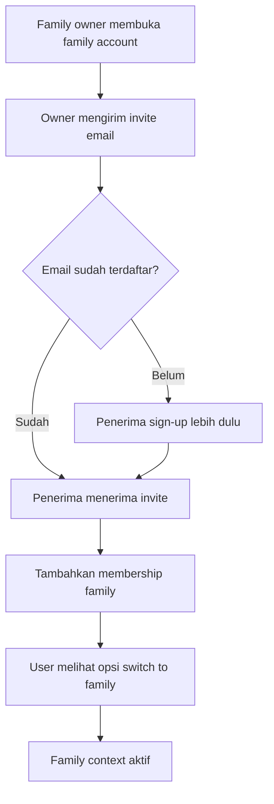
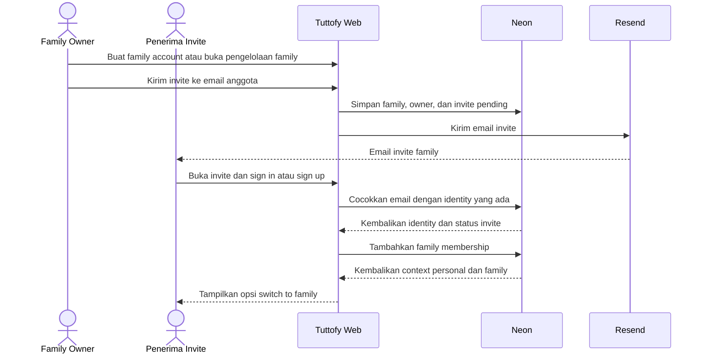

# Family Account

## Gambaran Umum

Family account di Tuttofy memungkinkan satu identitas pengguna bergabung ke context keluarga bersama, di mana `family owner` menjadi pemilik utama billing dan dapat mengundang anggota lain melalui email. Fitur ini dirancang untuk mendukung pola belajar keluarga seperti orang tua yang ingin belajar sendiri, mengelola pengalaman belajar anak, atau berbagi akses dalam satu unit keluarga tanpa membuat sistem auth terpisah.

## Tujuan

Fitur ini ada untuk mendukung skenario penggunaan keluarga dengan model kepemilikan dan pembayaran yang jelas. Family account membantu Tuttofy memisahkan identitas login dari context penggunaan, sehingga satu user dapat tetap memakai akun yang sama untuk kebutuhan personal maupun family sambil menjaga billing, membership, dan aktivitas belajar tetap berada pada struktur yang benar.

## Pengguna / Peran

- Family owner
- Family member
- Parent
- Child
- Tim product dan engineering internal

## Alur Utama

1. Pengguna membuat atau memiliki akun Tuttofy melalui flow auth utama.
2. Pengguna yang menjadi `family owner` membuat family account atau mengaktifkan context family dari akun yang sudah ada.
3. Family owner mengirim invite ke email anggota family.
4. Jika email tujuan belum pernah terdaftar, penerima invite menyelesaikan sign-up lalu masuk ke family context yang diundang.
5. Jika email tujuan sudah memiliki akun Tuttofy, penerima invite tidak membuat akun baru dan cukup menerima membership pada identitas yang sama.
6. Setelah invite diterima, pengguna melihat context baru pada akun yang sama dan dapat memilih `switch to family`.
7. Saat masuk ke family context, pengguna hanya melihat data, course enrollment, dan pengalaman belajar yang relevan dengan family tersebut sesuai permission.
8. Billing family tetap melekat pada family owner walaupun anggota family bertambah.

## Diagram Visual

## Sequence Interaksi

## Aturan Bisnis

- Family account adalah `product context` atau workspace, bukan akun auth yang terpisah.
- Satu identitas dapat memiliki lebih dari satu context, seperti `personal` dan `family`.
- Invite family harus menerima email baru maupun email yang sudah pernah terdaftar di Tuttofy.
- Jika email invite sudah memiliki akun, sistem tidak membuat identitas baru.
- `family owner` adalah pemilik billing utama untuk seluruh family account.
- Detail subscription, quota, atau harga family didokumentasikan terpisah ketika fitur payment aktif.
- Family membership disimpan di domain data aplikasi Tuttofy, bukan di Clerk.
- Penerimaan invite harus berbasis email yang sama dengan email tujuan invite.
- Opsi `switch to family` hanya muncul jika user memang memiliki lebih dari satu context.
- Metadata onboarding `parent`, `child`, atau `personal` tidak otomatis menciptakan family membership.
- Permission rinci seperti siapa yang boleh mengundang anggota lain harus mengikuti aturan family role yang disepakati produk.

## Data / Field

- `family_id`
- `family_name`
- `family_owner_user_id`
- `family_membership_id`
- `family_membership_role`
- `family_membership_status`
- `invite_email`
- `invite_token`
- `invite_status`
- `invite_sent_at`
- `invite_accepted_at`
- `active_context`
- `available_contexts[]`
- `billing_owner_user_id`

## Edge Cases

- Email invite salah ketik dan invite belum diterima.
- Penerima invite membuka link saat belum login.
- Penerima invite membuka link dengan akun yang email-nya berbeda dari email invite.
- Email tujuan sudah memiliki akun dan sudah menjadi anggota family lain.
- User memiliki context personal dan beberapa family sehingga perlu memilih context yang benar.
- Family owner mencoba mengundang email yang sudah menjadi member pada family yang sama.
- Invite kedaluwarsa sebelum diterima.
- Family owner membatalkan invite sebelum penerima menerimanya.
- Billing family bermasalah tetapi membership tetap ada.

## Fitur Terkait

- Authentication
- Onboarding
- User profile
- Join course
- Student learning progress

## Catatan

- Dokumen ini fokus pada context account dan membership, bukan pada detail learning flow di dalam course.
- Jika di masa depan Tuttofy mendukung child tanpa login mandiri, skenario itu sebaiknya didokumentasikan sebagai perluasan family account, bukan sebagai perubahan pada auth inti.
