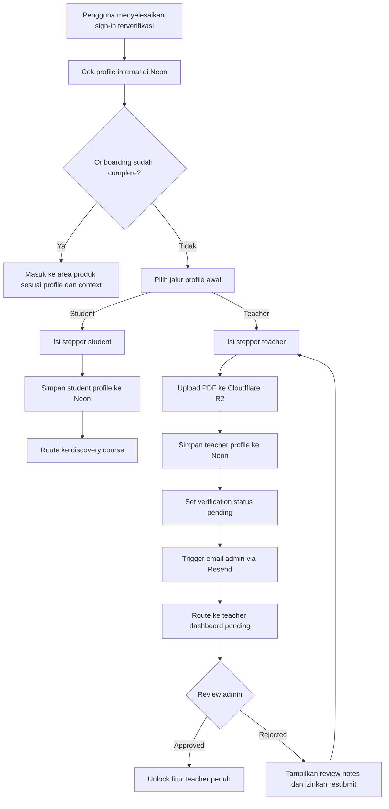
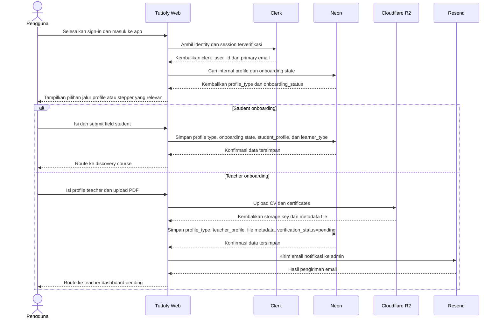

# Onboarding

## Gambaran Umum

Onboarding di Tuttofy core web mengatur personalisasi first-login setelah pengguna menyelesaikan authentication dan email verification. Fitur ini melengkapi profile dasar pengguna sebagai `student` atau `teacher`, mengumpulkan data profile yang relevan melalui form stepper, lalu menyiapkan pengguna untuk masuk ke pengalaman produk yang sesuai tanpa mencampurkan onboarding dengan enrollment course atau family membership.

## Tujuan

Fitur ini ada untuk memastikan setiap pengguna baru memiliki profile internal yang lengkap, tipe profile awal yang jelas, dan jalur masuk produk yang sesuai sejak first verified sign-in. Onboarding juga menjadi titik awal bagi teacher untuk mengirim data verifikasi ke Tuttofy sebelum memperoleh akses penuh ke fitur teacher, sementara untuk student onboarding berfungsi sebagai setup profile awal dan metadata pembelajar.

## Pengguna / Peran

- Student
- Teacher
- Tim product dan engineering internal
- Tim admin internal yang meninjau teacher onboarding melalui sistem admin terpisah

## Alur Utama

1. Pengguna menyelesaikan sign-in dan verifikasi email melalui Clerk.
2. Tuttofy memeriksa `clerk_user_id` dan status profile internal pengguna di Neon.
3. Jika pengguna belum memiliki profile internal lengkap atau `onboarding_status` belum `complete`, pengguna diarahkan ke onboarding.
4. Pada langkah pertama, pengguna memilih jalur profile awal: `student` atau `teacher`.
5. Jika memilih `student`, pengguna mengisi form stepper berisi `full_name`, `birth_year`, `primary_language`, `other_languages[]`, `learning_topics[]`, dan pilihan `learner_type` berupa `parent`, `child`, atau `personal`.
6. Nilai `learner_type` disimpan sebagai metadata atau flag domain, bukan sebagai role permission atau family membership.
7. Setelah submit student onboarding, Tuttofy membuat atau melengkapi `student_profile` di Neon, menandai onboarding selesai, lalu mengarahkan pengguna ke pengalaman discovery course atau area produk yang sesuai.
8. Jika memilih `teacher`, pengguna mengisi form stepper berisi `full_name`, `birth_year`, `specialities[]`, lalu mengunggah `cv_file` dan `certificate_files[]` dalam format PDF.
9. Tuttofy mengunggah file teacher ke Cloudflare R2 lebih dulu, kemudian menyimpan metadata file, data profile, dan status verifikasi di Neon.
10. Setelah submit teacher onboarding, Tuttofy menetapkan `verification_status` menjadi `pending`, mengirim email notifikasi internal ke admin melalui Resend, lalu mengarahkan teacher ke teacher dashboard versi pending.
11. Pada status `pending`, teacher tetap dapat memperbarui data diri, CV, dan certificates, tetapi fitur teacher lain tetap locked sampai status berubah menjadi `approved`.
12. Jika teacher `rejected`, teacher melihat catatan review, dapat memperbarui data yang diminta, lalu submit ulang agar status kembali ke `pending` dan notifikasi admin terkirim lagi.
13. Pada login berikutnya, pengguna yang onboarding-nya sudah `complete` tidak melihat onboarding lagi dan langsung diarahkan ke area produk yang sesuai dengan profile, status, dan context yang aktif.

## Diagram Visual

## Sequence Interaksi

## Aturan Bisnis

- Onboarding hanya dimulai setelah first verified sign-in berhasil melalui Clerk.
- Onboarding menentukan jalur profile awal pengguna: `student` atau `teacher`.
- `learner_type` untuk student hanya berupa metadata domain seperti `parent`, `child`, atau `personal`.
- `learner_type` tidak boleh diperlakukan sebagai permission role, billing role, atau family membership.
- `Clerk` tetap menjadi source of truth untuk identity, authentication, email verification, dan session.
- `Neon` menjadi source of truth untuk `profile_type`, `onboarding_status`, `student_profile`, `teacher_profile`, `verification_status`, `review_notes`, serta metadata file upload.
- `Clerk metadata` boleh dipakai sebagai cache ringan atau routing hint, tetapi bukan source of truth untuk data profile atau review state.
- `Cloudflare R2` menyimpan file CV dan certificates teacher, sementara metadata file dan kaitannya ke profile tetap disimpan di Neon.
- Upload teacher pada MVP hanya menerima file `PDF`.
- `language`, `other_languages`, `specialities`, dan `learning_topics` memakai master list terkontrol milik sistem agar konsisten untuk listing, filter, dan pencarian.
- Onboarding student tidak otomatis membuat enrollment course, learning path, atau family membership.
- `student` yang menyelesaikan onboarding diarahkan ke area discovery agar dapat melihat teacher profile dan course sebelum memulai exploration.
- `teacher` yang menyelesaikan onboarding selalu masuk ke `teacher dashboard pending` lebih dulu.
- Pada status `pending`, teacher hanya dapat mengakses area untuk melihat atau memperbarui profile, CV, dan certificates.
- Fitur teacher utama tetap locked sampai `verification_status` berubah menjadi `approved`.
- Review state MVP untuk teacher adalah `pending`, `approved`, dan `rejected`.
- Jika teacher `rejected`, sistem harus menampilkan `review_notes`, mengizinkan pembaruan data, dan mendukung resubmit.
- Submit pertama teacher dan resubmit setelah `rejected` sama-sama memicu pengiriman email notifikasi admin melalui Resend.
- Kegagalan pengiriman email admin tidak membatalkan penyimpanan data onboarding teacher yang sudah berhasil disimpan di Neon.

## Data / Field

- `clerk_user_id`
- `primary_email`
- `profile_type`
- `onboarding_status`
- `student_profile.full_name`
- `student_profile.birth_year`
- `student_profile.primary_language`
- `student_profile.other_languages[]`
- `student_profile.learning_topics[]`
- `student_profile.learner_type`
- `teacher_profile.full_name`
- `teacher_profile.birth_year`
- `teacher_profile.specialities[]`
- `teacher_profile.verification_status`
- `teacher_profile.submitted_at`
- `teacher_profile.reviewed_at`
- `teacher_profile.review_notes`
- `upload_metadata.file_type`
- `upload_metadata.storage_key`
- `upload_metadata.original_filename`
- `upload_metadata.mime_type`
- `upload_metadata.uploaded_at`
- `admin_notification_last_sent_at`
- `admin_notification_last_status`

## Edge Cases

- Pengguna sign out di tengah onboarding lalu kembali lagi dan harus melanjutkan dari state terakhir yang tersimpan di Neon.
- Pengguna sudah memiliki identity terverifikasi di Clerk tetapi belum memiliki internal profile lengkap di Neon.
- Student memilih `learner_type` yang berbeda dari context family yang sedang aktif; sistem tetap memperlakukan nilai itu sebagai metadata, bukan source of truth membership.
- Teacher mencoba mengunggah file non-PDF.
- Upload ke R2 gagal setelah teacher mengisi form.
- Data teacher berhasil tersimpan di Neon tetapi email admin gagal terkirim melalui Resend.
- Teacher berstatus `pending` mencoba mengakses fitur teacher yang masih locked.
- Teacher berstatus `rejected` memperbarui data lalu melakukan resubmit.
- Teacher yang sudah `approved` tidak boleh tetap terjebak pada pending dashboard.
- Student yang onboarding-nya sudah selesai tidak boleh kembali ke role selection pada login berikutnya.

## Fitur Terkait

- Authentication
- Tech Stack
- User profile
- Teacher profile
- Family account
- Search course
- Join course
- Teacher dashboard

## Catatan

- Dokumen ini hanya mendefinisikan perilaku onboarding produk, bukan detail implementasi kode.
- Detail workflow review admin teacher yang lebih lengkap dapat didokumentasikan terpisah karena sistem admin berada di aplikasi terpisah.
- Best practice MVP untuk data personalisasi adalah menyimpannya di `Neon`, bukan di `Clerk`, karena data tersebut bersifat domain aplikasi, relasional, memerlukan review state, dan berpotensi berkembang di masa depan.
- Flow `exploration`, `learning path`, `search course`, dan `join course` didokumentasikan pada halaman fitur terpisah karena terjadi setelah onboarding selesai.
