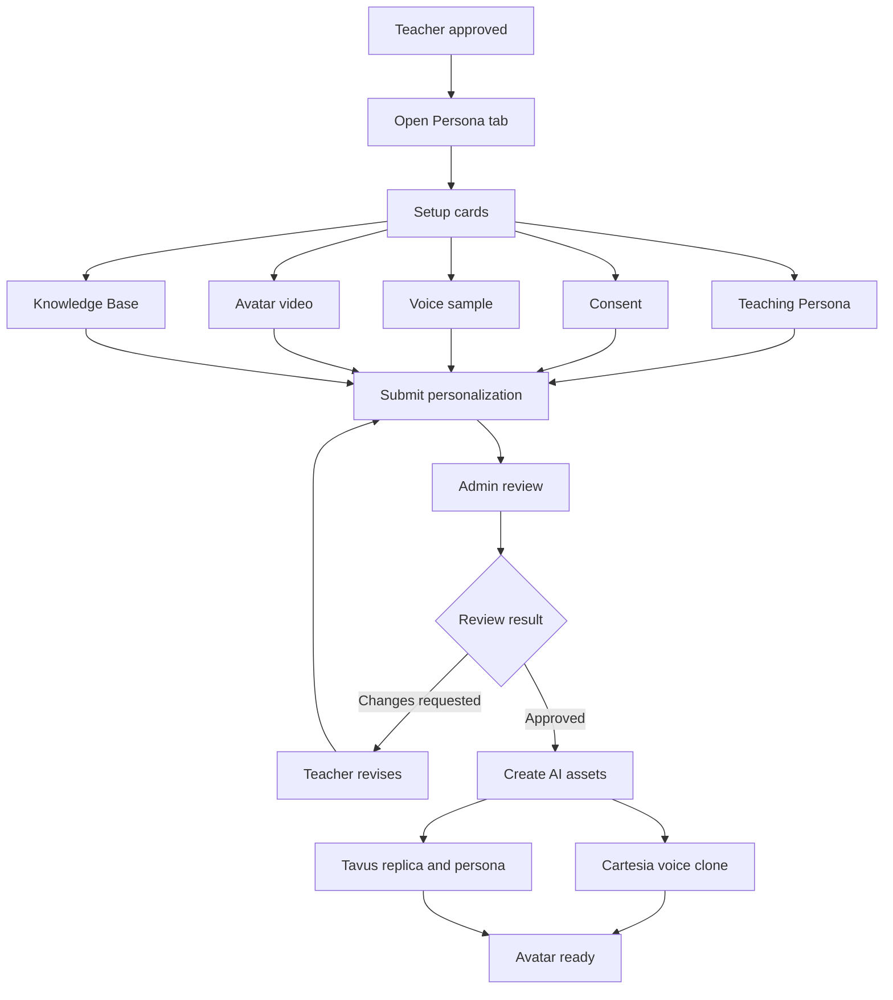
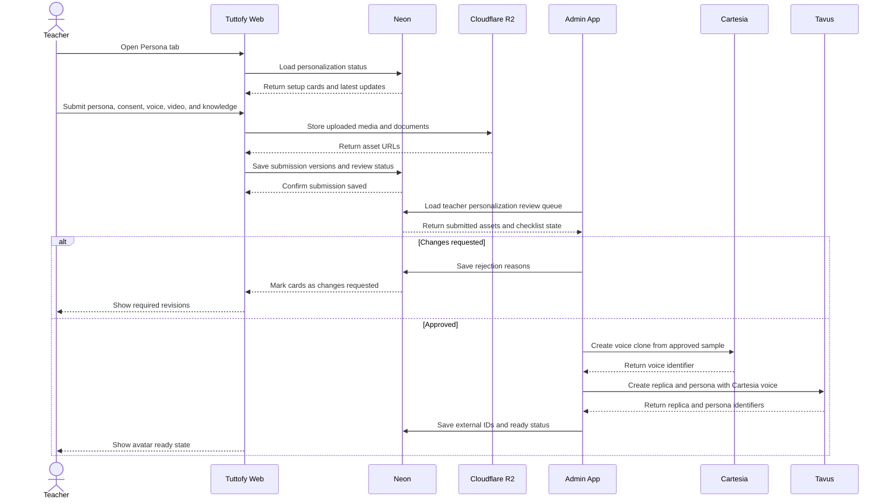

# Teacher Personalization

## Gambaran Umum

Teacher personalization di Tuttofy mengatur proses setelah teacher disetujui untuk menyiapkan diri menjadi tutor avatar AI. Fitur ini mengumpulkan teaching persona, consent, voice sample untuk Cartesia, training video untuk Tavus replica, dan knowledge base sebelum semuanya direview manual oleh admin. Setelah lolos review, Tuttofy dapat membuat atau mengaktifkan aset AI yang dipakai dalam sesi avatar pembelajar.

## Tujuan

Fitur ini ada untuk memastikan avatar teacher tidak hanya bisa tampil dan berbicara, tetapi juga memiliki gaya mengajar, suara, wajah, batas pengetahuan, dan kualitas media yang layak dipakai pembelajar. Manual review tetap diperlukan karena kualitas audio, video, consent, dan materi pengetahuan perlu dinilai manusia sebelum aset dikirim ke Cartesia atau Tavus.

## Pengguna / Peran

- Teacher
- Admin reviewer
- Tim product internal
- Tim engineering internal
- Student sebagai pengguna akhir avatar yang sudah aktif

## Alur Utama

1. Teacher menyelesaikan onboarding dan disetujui sebagai teacher aktif.
2. Tuttofy membuka tab `Persona` di dashboard teacher bersama tab lain seperti `Dashboard` dan `Course`.
3. Di dalam tab `Persona`, teacher melihat card setup untuk `Teaching Persona`, `Consent`, `Voice`, `Avatar Video`, dan `Knowledge Base`.
4. Teacher mengisi kuisioner teaching persona untuk membentuk gaya belajar, tone, pendekatan mengajar, subject scope, dan batasan respons.
5. Teacher mengirim consent yang dibutuhkan untuk penggunaan likeness dan voice.
6. Teacher merekam atau mengunggah voice sample yang akan direview lalu digunakan untuk membuat voice clone di Cartesia.
7. Teacher merekam atau mengunggah training video yang akan direview lalu digunakan untuk membuat Tavus replica.
8. Teacher mengunggah knowledge base seperti PDF atau dokumen pendukung lain sesuai batas produk yang diaktifkan.
9. Setelah semua bagian wajib tersubmit, status personalization masuk ke `under_review`.
10. Admin membuka aplikasi admin terpisah untuk memvalidasi setiap bagian berdasarkan checklist review.
11. Jika ada bagian yang belum layak, admin mengirim `changes_requested` dengan alasan spesifik.
12. Jika semua bagian lolos, Tuttofy membuat atau mengaktifkan voice clone di Cartesia, replica dan persona di Tavus, serta menyimpan ID eksternal yang dibutuhkan.
13. Setelah aset AI siap, teacher personalization masuk ke status `ready` dan dapat dipakai dalam avatar conversation session.

## Diagram Visual

## Sequence Interaksi

## Aturan Bisnis

- Teacher hanya dapat memulai teacher personalization setelah teacher profile atau onboarding teacher disetujui.
- Tab `Persona` di dashboard teacher menampilkan card status untuk `Teaching Persona`, `Consent`, `Voice`, `Avatar Video`, dan `Knowledge Base`.
- Setiap card harus menampilkan status, latest update, versi terakhir, dan aksi utama seperti `Manage`, `Submit`, `Re-submit`, atau `View`.
- Status utama personalization menggunakan lifecycle: `draft`, `submitted`, `under_review`, `changes_requested`, `approved`, `creating_ai_assets`, `processing`, `ready`, `rejected`, dan `disabled`.
- Status per card menggunakan lifecycle: `not_started`, `in_progress`, `submitted`, `approved`, `rejected`, `locked`, dan `needs_update`.
- Manual review wajib dilakukan sebelum Tuttofy membuat voice clone di Cartesia atau replica/persona di Tavus.
- Setelah voice dan video disetujui, teacher tidak boleh mengubah aset aktif secara langsung. Perubahan harus dibuat sebagai versi baru atau re-submission.
- Setelah verified, teacher tetap boleh mengubah `Teaching Persona` dan `Knowledge Base`, tetapi perubahan signifikan dapat memicu review ulang.
- Consent harus disimpan sebagai bagian terpisah agar audit penggunaan likeness dan voice tidak tercampur dengan training video biasa.
- Voice sample digunakan untuk Cartesia voice cloning dan TTS, bukan sebagai pengganti Tavus replica video.
- Tavus persona harus menggunakan voice Cartesia melalui TTS configuration seperti `tts_engine: cartesia` dan `external_voice_id`.
- Tavus replica tetap dibuat dari training video atau asset visual lain sesuai training path yang dipilih.
- Knowledge base harus direview dari sisi relevansi, hak penggunaan, keamanan data, dan kesesuaian subject scope.
- Student tidak boleh melihat atau memakai avatar teacher sebelum status personalization mencapai `ready`.
- Preview atau test conversation internal dapat berada di aplikasi admin terpisah, bukan wajib di Tuttofy core web app.

## Requirement Review

### Teaching Persona

- Gaya mengajar jelas, misalnya supportive, Socratic, direct, visual, atau practice-based.
- Subject scope dan audience level jelas.
- Tone dan bahasa sesuai brand Tuttofy.
- Batasan respons jelas agar avatar tidak menjawab di luar kompetensi teacher.
- Prompt tidak mengandung klaim berlebihan atau janji hasil belajar yang tidak realistis.

### Consent

- Teacher menyetujui penggunaan voice dan likeness untuk pembuatan avatar AI.
- Consent dapat diverifikasi dan terhubung ke teacher yang benar.
- Jika menggunakan Tavus training video, consent statement harus mengikuti requirement Tavus atau disediakan sebagai consent video terpisah bila flow produk memakai itu.

### Voice

- Voice sample harus bersih, jelas, dan hanya berisi suara teacher.
- Tidak ada background noise dominan, suara orang lain, musik, atau echo berlebihan.
- Sample harus cukup natural untuk cloning dan tidak terlalu banyak jeda kosong.
- Cartesia voice identifier disimpan setelah cloning berhasil.
- Jika voice clone terdengar tidak mirip atau kurang layak, status harus menjadi `changes_requested` atau `rejected`.

### Avatar Video

- File training video mengikuti requirement Tavus: `.mp4`, encoded `h.264`, ukuran di bawah `750MB`, minimal `1 menit`, dan minimal `25fps`.
- Durasi optimal untuk training video adalah sekitar `1.5-2 menit`.
- Video sebaiknya berisi struktur bicara yang natural dan dapat mencakup bagian silent sesuai panduan kualitas Tavus.
- Teacher harus berada stabil, menghadap kamera, dengan wajah jelas, satu orang dalam frame, dan kamera di eye level.
- Lighting harus stabil dan merata.
- Background harus rapi dan tidak mengganggu.
- Video harus one take, tidak diedit, tidak memiliki cut, dan tidak memakai video AI-generated.
- Suara dalam video harus bersih karena Tavus dapat menolak training jika ada background noise atau suara lain.

### Knowledge Base

- Pada MVP, Tuttofy dapat membatasi upload knowledge base ke PDF agar review lebih sederhana.
- Jika diperluas, Tavus Knowledge Base juga mendukung beberapa format seperti PDF, TXT, DOCX, DOC, PNG, JPG, PPTX, CSV, XLSX, dan website URL.
- Setiap dokumen harus memiliki status review dan dapat diaktifkan atau dinonaktifkan.
- Dokumen harus relevan dengan subject scope teacher dan course yang akan dibuat.
- Dokumen tidak boleh berisi data sensitif yang tidak seharusnya dipakai dalam sesi pembelajar.

## Data / Field

- `teacher_personalization_id`
- `teacher_id`
- `personalization_status`
- `submitted_at`
- `reviewed_at`
- `reviewed_by_admin_id`
- `latest_update_at`
- `teaching_persona_id`
- `teaching_style`
- `tone`
- `primary_language`
- `subject_scope`
- `audience_level`
- `guardrails`
- `consent_status`
- `consent_asset_id`
- `voice_submission_id`
- `voice_status`
- `voice_asset_id`
- `cartesia_voice_id`
- `avatar_video_submission_id`
- `avatar_video_status`
- `avatar_video_asset_id`
- `tavus_replica_id`
- `tavus_persona_id`
- `knowledge_base_collection_id`
- `knowledge_document_ids[]`
- `tavus_document_ids[]`
- `card_status`
- `card_latest_update_at`
- `review_checklist`
- `review_notes`
- `rejection_reason`
- `version`
- `locked_at`

## Edge Cases

- Teacher sudah approved tetapi belum membuka tab `Persona`.
- Teacher submit sebagian card tetapi belum melengkapi semua requirement wajib.
- Teacher mengunggah voice yang bersih tetapi tidak cukup mirip setelah cloning di Cartesia.
- Teacher mengunggah video dengan format benar tetapi gagal Tavus karena gerakan berlebihan, lighting buruk, atau wajah terlalu kecil.
- Consent tidak cocok dengan nama teacher atau tidak dapat diverifikasi.
- Admin menyetujui persona tetapi menolak voice atau video.
- Cartesia berhasil membuat voice clone tetapi Tavus persona gagal dibuat.
- Tavus replica training membutuhkan beberapa jam sehingga status harus tetap informatif selama processing.
- Knowledge base berhasil diupload tetapi gagal diproses oleh Tavus.
- Teacher memperbarui knowledge base setelah avatar sudah ready sehingga perlu review dokumen baru tanpa menonaktifkan semua aset yang sudah approved.
- Teacher meminta re-record video setelah avatar aktif sehingga sistem perlu membuat versi baru tanpa merusak replica aktif.
- Admin app sedang tidak tersedia sehingga teacher submission tetap tersimpan tetapi review tertunda.

## Fitur Terkait

- Tech Stack
- Onboarding
- Teacher profile
- Course creation
- Upload learning material
- Guardrails and knowledge scope
- Avatar conversation session
- Admin management

## Catatan

- Dokumen ini berfokus pada setup teacher avatar sebelum dipakai pembelajar, bukan pada pengalaman belajar student setelah join course.
- Cartesia digunakan untuk voice cloning dan TTS. Tavus digunakan untuk replica, persona, knowledge attachment, dan live avatar conversation.
- Untuk private voice Cartesia, API key harus disimpan di backend dan tidak boleh diekspos ke client.
- Requirement Tavus dan Cartesia perlu dicek ulang dari dokumentasi resmi sebelum implementasi API final karena provider dapat mengubah detail teknis.
- Referensi awal: Tavus persona TTS mendukung Cartesia melalui `external_voice_id`, Tavus replica training memiliki requirement video ketat, dan Cartesia menyediakan voice cloning melalui Playground dan API.
