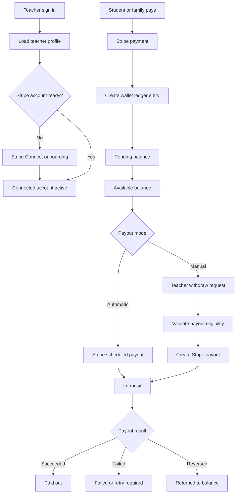
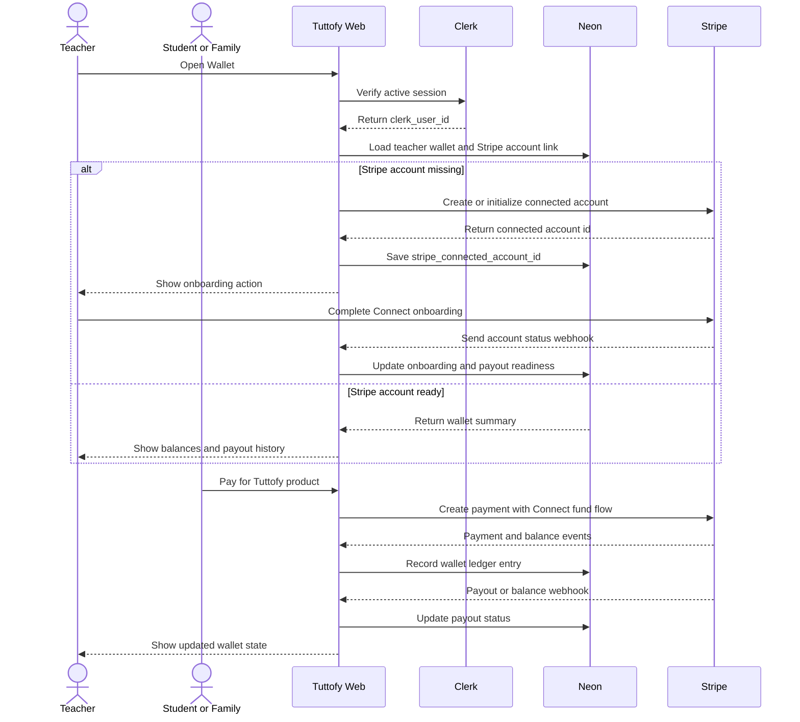

# Teacher Wallet

## Gambaran Umum

Teacher wallet di Tuttofy adalah area dashboard yang menampilkan penghasilan teacher, status saldo, dan riwayat payout berdasarkan alur Stripe Connect. Wallet ini bukan dompet uang terpisah yang menyimpan dana di luar Stripe. Tuttofy menyimpan ledger dan status produk di Neon, sementara pergerakan dana, saldo Stripe, onboarding rekening, dan payout ke rekening teacher dikelola melalui Stripe.

## Tujuan

Fitur ini ada agar teacher memiliki visibilitas jelas terhadap penghasilan yang sedang diproses, saldo yang sudah tersedia untuk payout, dan pencairan yang sudah atau sedang berjalan. Karena skema pembagian pendapatan Tuttofy masih direncanakan, dokumentasi ini menetapkan fondasi wallet, status saldo, dan integrasi Stripe tanpa mengunci formula revenue share final.

## Pengguna / Peran

- Teacher
- Student atau family payer sebagai sumber transaksi pembayaran
- Admin finance atau operations
- Tim product internal
- Tim engineering internal
- Stripe sebagai payment dan payout provider
- Clerk sebagai identity provider

## Alur Utama

1. Teacher sign in ke Tuttofy melalui Clerk.
2. Tuttofy membaca `clerk_user_id`, lalu memuat teacher profile dan record wallet internal dari Neon.
3. Jika teacher belum memiliki Stripe connected account, Tuttofy membuat atau menginisialisasi account tersebut melalui Stripe Connect.
4. Teacher menyelesaikan onboarding Stripe untuk verifikasi identitas, requirement payout, dan payout account seperti rekening bank yang didukung.
5. Tuttofy menyimpan `stripe_connected_account_id` di record teacher/wallet internal, dan dapat menyimpan referensi non-publik di Clerk private metadata bila dibutuhkan untuk lookup backend.
6. Saat student atau family melakukan pembayaran, Stripe memproses payment melalui platform Tuttofy.
7. Tuttofy menghitung atau menandai potensi bagian teacher sebagai wallet ledger entry berdasarkan skema revenue yang aktif pada saat transaksi.
8. Selama dana belum aman atau belum settlement, wallet menampilkan nilai tersebut sebagai `pending`.
9. Setelah dana tersedia menurut Stripe dan aturan Tuttofy, wallet menampilkan bagian tersebut sebagai `available`.
10. Payout dapat berjalan otomatis berdasarkan schedule Stripe atau manual berdasarkan aksi `Withdraw`, tergantung keputusan produk.
11. Ketika payout dibuat, wallet menampilkan status `in_transit`.
12. Setelah payout berhasil, wallet mencatat status `paid_out` dan menampilkan riwayat pencairan.
13. Jika payout gagal, refund, dispute, atau saldo negatif terjadi, wallet memperbarui ledger dan status yang relevan.

## Diagram Visual

## Sequence Interaksi

## Aturan Bisnis

- `Clerk` adalah source of truth untuk identitas dan session teacher.
- `Neon` adalah source of truth untuk teacher profile, wallet ledger, status payout produk, dan mapping antara `teacher_id`, `clerk_user_id`, dan `stripe_connected_account_id`.
- `Stripe` adalah source of truth untuk payment, connected account, Stripe balance, payout account, payout object, dan settlement status.
- Teacher wallet tidak boleh menjanjikan dana sebagai `available` sebelum dana memenuhi syarat availability Stripe dan aturan internal Tuttofy.
- Wallet harus memisahkan minimal status saldo `pending`, `available`, `in_transit`, `paid_out`, `failed`, `reversed`, `held`, dan `adjusted`.
- Income teacher belum ditentukan pada fase dokumentasi ini. Formula revenue share harus menjadi konfigurasi atau aturan bisnis terpisah sebelum production payout diaktifkan.
- Untuk platform baru, integrasi Stripe Connect harus dirancang sebagai Accounts v2 dan menggunakan configuration/controller responsibilities, bukan bergantung pada istilah account type legacy.
- Payout default yang direkomendasikan untuk MVP adalah payout otomatis atau admin-controlled payout. Manual `Withdraw` dapat ditambahkan setelah aturan minimum payout, hold period, fee, dan support flow siap.
- Jika manual withdrawal diaktifkan, teacher hanya dapat menarik saldo `available`, bukan `pending`.
- Tuttofy dapat menahan sebagian dana sebagai reserve untuk refund, dispute, chargeback, fraud review, atau policy review.
- Refund, dispute, atau adjustment setelah ledger dibuat harus menghasilkan ledger entry koreksi, bukan menghapus riwayat transaksi asli.
- Teacher yang belum menyelesaikan onboarding Stripe tidak dapat menerima payout walaupun ledger internal sudah mencatat pending earning.
- Teacher yang status Stripe account-nya `restricted`, `requirements_due`, atau payout-disabled harus melihat status yang jelas dan aksi penyelesaian onboarding.
- Payout method harus dikumpulkan melalui Stripe-hosted atau embedded onboarding bila memungkinkan agar Tuttofy tidak menyimpan detail rekening sensitif secara langsung.
- Company Tuttofy berada di Singapore. Ketersediaan payout ke teacher lintas negara tetap bergantung pada eligibility Stripe Connect, cross-border payouts, negara connected account, mata uang, dan requirement lokal.
- Jika teacher berada di negara yang belum didukung untuk connected account atau payout tertentu, wallet harus menampilkan status tidak eligible dan mengarahkan ke review manual.
- Payout schedule, settlement timing, dan biaya dapat berbeda per negara, mata uang, payment method, dan konfigurasi Stripe.

## Model Saldo

- `pending`: earning sudah tercatat dari transaksi, tetapi belum tersedia untuk payout.
- `available`: earning sudah memenuhi syarat untuk payout menurut Stripe dan aturan Tuttofy.
- `in_transit`: payout sudah dibuat dan sedang dikirim ke payout account teacher.
- `paid_out`: payout berhasil dikirim.
- `failed`: payout gagal dan perlu retry atau koreksi payout method.
- `reversed`: payout dibalikkan atau dana kembali ke balance.
- `held`: dana sengaja ditahan karena review, refund window, dispute, atau kebijakan internal.
- `adjusted`: koreksi ledger karena refund, dispute, kesalahan perhitungan, fee, atau perubahan policy.

## Model Payout

### Payout Otomatis

Payout otomatis membuat teacher menerima dana berdasarkan schedule Stripe atau schedule yang dikonfigurasi oleh platform. Model ini lebih sederhana untuk MVP karena teacher tidak perlu mengajukan withdrawal, tetapi Tuttofy tetap perlu menampilkan tanggal estimasi payout dan riwayat payout.

### Manual Withdrawal

Manual withdrawal membuat teacher menekan aksi `Withdraw` dari wallet. Tuttofy harus memvalidasi saldo available, minimum payout, account readiness, hold, dan risiko refund/dispute sebelum membuat payout melalui Stripe. Model ini memberi kontrol lebih besar kepada teacher, tetapi membutuhkan support dan aturan finance yang lebih matang.

## Data / Field

- `teacher_wallet_id`
- `teacher_id`
- `clerk_user_id`
- `stripe_connected_account_id`
- `stripe_account_status`
- `stripe_requirements_status`
- `payouts_enabled`
- `charges_enabled`
- `default_currency`
- `wallet_status`
- `pending_balance`
- `available_balance`
- `held_balance`
- `lifetime_earnings`
- `lifetime_paid_out`
- `wallet_ledger_entry_id`
- `ledger_entry_type`
- `ledger_entry_status`
- `gross_amount`
- `platform_fee_amount`
- `stripe_fee_amount`
- `teacher_share_amount`
- `currency`
- `source_payment_id`
- `source_course_id`
- `source_enrollment_id`
- `source_payer_context`
- `available_on`
- `hold_until`
- `payout_id`
- `payout_status`
- `payout_arrival_date`
- `payout_failure_code`
- `payout_failure_message`
- `manual_withdrawal_requested_at`
- `reviewed_by_admin_id`
- `created_at`
- `updated_at`

## Edge Cases

- Teacher sudah punya Clerk account dan teacher profile, tetapi belum memiliki Stripe connected account.
- Teacher membuat connected account tetapi belum menyelesaikan onboarding.
- Stripe meminta requirement tambahan setelah teacher sebelumnya sudah aktif.
- Teacher mengganti negara, legal entity, atau payout account sehingga account perlu review ulang.
- Teacher berada di negara yang belum eligible untuk payout dari platform Singapore.
- Payment berhasil tetapi transfer atau pencatatan earning teacher tertunda.
- Payment masuk dalam currency yang berbeda dari payout currency teacher.
- Dana masih pending karena settlement timing atau risk review.
- Refund terjadi setelah earning teacher sudah tercatat.
- Dispute atau chargeback membuat balance teacher negatif atau membutuhkan reserve.
- Payout gagal karena rekening salah, rekening ditutup, atau requirement Stripe berubah.
- Payout sudah `in_transit` tetapi bank membutuhkan waktu tambahan untuk menyelesaikan deposit.
- Webhook Stripe terlambat, dikirim ulang, atau diterima di luar urutan.
- Ledger internal dan event Stripe sementara tidak sinkron dan membutuhkan reconciliation job.
- Manual withdrawal diklik beberapa kali sehingga perlu idempotency dan lock.
- Admin menahan payout teacher karena review policy atau dugaan penyalahgunaan.

## Fitur Terkait

- Tech Stack
- Authentication
- Onboarding
- Teacher profile
- Teacher personalization
- Course discovery and join
- Course learning experience
- Family account
- Payment or subscription
- Admin management

## Catatan

- Untuk pembayaran course atau subscription yang melibatkan teacher payout, Stripe Connect lebih sesuai daripada hanya Stripe Checkout biasa karena dana perlu dihubungkan ke connected account teacher.
- Destination charges cocok sebagai titik awal jika Tuttofy sebagai platform menerima payment dan mengatur pemindahan bagian teacher ke connected account.
- Separate charges and transfers dapat dipertimbangkan jika satu pembayaran perlu dibagi ke beberapa teacher atau jika skema revenue share membutuhkan alokasi belakangan.
- Dokumentasi ini sengaja tidak menetapkan persentase teacher share, minimum payout, fee policy, atau tax handling karena masih menunggu keputusan model bisnis.
- Sebelum production, tim perlu memvalidasi availability Stripe Connect dan cross-border payouts untuk kombinasi negara platform Singapore, negara teacher, negara payer, dan currency yang dipakai.
