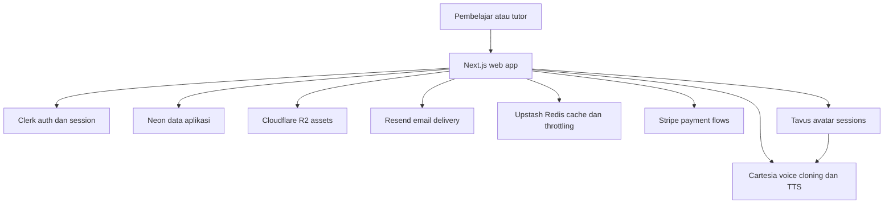
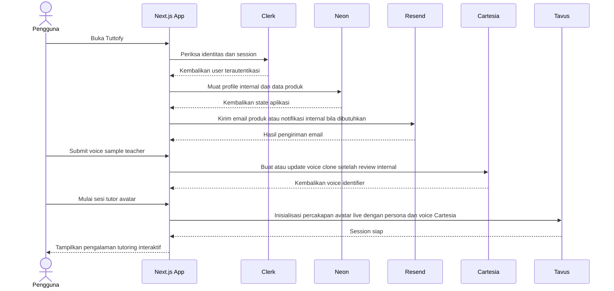

# Tech Stack

## Gambaran Umum

Tuttofy core web app menggunakan stack managed modern agar tim dapat fokus pada perilaku produk untuk tutor dan pembelajar, tanpa perlu membangun ulang infrastruktur umum dari nol. Setiap layanan memiliki tanggung jawab yang jelas dari sisi produk dan perlu didokumentasikan berdasarkan perannya dalam pengalaman Tuttofy.

## Tujuan

Halaman ini menjelaskan stack teknologi tingkat tinggi yang saat ini dipakai oleh Tuttofy, tanggung jawab tiap layanan, dan batas produk di antara layanan-layanan tersebut. Dokumen ini ditujukan untuk menjaga penyelarasan product, design, dan engineering tanpa masuk ke detail infrastruktur tingkat rendah.

## Pengguna / Peran

- Tim product internal
- Tim design
- Tim engineering
- Founder atau operator yang membutuhkan gambaran sistem bersama

## Alur Utama

1. Pembelajar atau tutor membuka Tuttofy core web app yang dibangun dengan Next.js.
2. Authentication, verifikasi identitas, dan session ditangani melalui Clerk.
3. Setelah pengguna dikenali, Tuttofy membaca atau membuat profile internal dan data produk terkait di Neon.
4. Jika pengguna mengakses materi pembelajaran atau aset yang diunggah, Tuttofy menggunakan Cloudflare R2 sebagai object storage.
5. Jika produk perlu mengirim email transaksional atau notifikasi internal seperti pemberitahuan teacher onboarding baru, Tuttofy menggunakan Resend sebagai email sender.
6. Jika alur produk memerlukan pembayaran atau transaksi berlangganan di fase aktifnya, Tuttofy menggunakan Stripe sebagai payment provider.
7. Jika produk membutuhkan cache, throttling, atau koordinasi data yang cepat dan ringan, Tuttofy menggunakan Upstash Redis.
8. Setelah teacher disetujui dan mulai membuat avatar, Tuttofy mengumpulkan persona, consent, video training, voice sample, dan knowledge base untuk direview sebelum aset AI dibuat.
9. Untuk suara teacher, Tuttofy menggunakan Cartesia sebagai voice cloning dan TTS provider, lalu menyimpan referensi voice yang dapat dipakai oleh persona Tavus.
10. Saat pembelajar memulai pengalaman tutor avatar, Tuttofy mengoordinasikan alur produk sementara Tavus menjalankan lapisan percakapan avatar secara langsung.

## Diagram Visual

## Sequence Interaksi

## Aturan Bisnis

- `Next.js` adalah framework untuk Tuttofy core web app, termasuk routing, rendering, dan custom UI flow.
- `Clerk` adalah source of truth untuk identitas, autentikasi, status verifikasi, dan session pengguna aktif.
- `Neon` adalah source of truth untuk data aplikasi internal setelah pengguna dikenali oleh Clerk.
- `Resend` digunakan untuk pengiriman email keluar seperti email transaksional atau notifikasi internal, tetapi bukan untuk menyimpan review state atau data bisnis aplikasi.
- `Tavus` bertanggung jawab atas percakapan tutor avatar secara live, bukan atas identitas pengguna Tuttofy atau kepemilikan data aplikasi.
- `Cartesia` digunakan untuk voice cloning dan text-to-speech teacher avatar. Voice Cartesia dipasang ke Tavus melalui konfigurasi TTS persona seperti `tts_engine: cartesia` dan `external_voice_id`.
- `Upstash Redis` digunakan untuk kebutuhan pendukung aplikasi seperti caching, rate limiting, atau data koordinasi ringan.
- `Cloudflare R2` menyimpan file dan object produk seperti materi pembelajaran atau aset yang dapat diunduh.
- `Stripe` digunakan sebagai payment provider untuk alur pembayaran, billing, atau transaksi subscription saat fitur tersebut aktif.
- Akses admin internal berada di luar cakupan Tuttofy core web app karena sistem admin berada di aplikasi terpisah.
- Voice sample, training video, consent, persona, dan knowledge base teacher harus melewati review manual sebelum Tuttofy membuat atau mengaktifkan aset ke Cartesia dan Tavus.
- Setelah voice clone atau replica disetujui, perubahan audio/video harus dibuat sebagai versi baru atau re-submission, bukan mengubah aset aktif secara langsung.

## Data / Field

- `stack_component`
- `service_name`
- `responsibility`
- `product_boundary`
- `owns_identity`
- `owns_app_data`
- `owns_files`
- `owns_email_delivery`
- `owns_payment_flow`
- `owns_voice_clone`
- `owns_avatar_session`
- `integration_notes`

## Edge Cases

- Jika Clerk tersedia tetapi Neon belum memiliki record user internal yang sesuai, Tuttofy perlu membuat atau melengkapi record tersebut saat onboarding atau first-login sync.
- Jika submit onboarding teacher berhasil disimpan di Neon tetapi Resend gagal mengirim email notifikasi admin, status onboarding tetap tersimpan dan notifikasi dapat dicoba ulang tanpa kehilangan data inti.
- Jika Tavus tidak tersedia, sesi percakapan avatar terdampak, tetapi identitas, profile, dan data produk inti tetap dimiliki oleh sistem Tuttofy.
- Jika Cartesia tidak tersedia, pembuatan atau penggunaan suara clone teacher dapat tertunda, tetapi review persona, video, knowledge base, dan data aplikasi tetap berjalan di Tuttofy.
- Jika voice clone Cartesia gagal dibuat atau kualitasnya tidak memenuhi standar, status voice teacher harus masuk ke `changes_requested` atau `rejected` tanpa membuat persona/avatar aktif untuk pembelajar.
- Jika voice identifier Cartesia berubah karena re-clone, persona Tavus yang memakai suara tersebut perlu diupdate agar memakai `external_voice_id` terbaru.
- Jika R2 sedang tidak tersedia, aset pembelajaran yang diunggah atau diunduh dapat gagal diakses walaupun bagian lain dari aplikasi tetap berjalan.
- Jika Stripe tidak tersedia, flow pembayaran atau subscription tidak dapat diselesaikan walaupun area produk lain mungkin tetap dapat diakses.
- Jika Upstash Redis mengalami degradasi, fitur yang bergantung pada cache atau throttling dapat berubah perilaku tanpa mengubah model identitas inti.

## Fitur Terkait

- Authentication
- User profile
- Onboarding
- Teacher profile
- Upload learning material
- Teacher personalization
- Voice cloning
- Payment or subscription
- Avatar conversation session
- Random conversation session

## Catatan

- Stack saat ini untuk Tuttofy core web adalah `Next.js`, `Clerk`, `Neon`, `Cloudflare R2`, `Resend`, `Upstash Redis`, `Stripe`, `Cartesia`, dan `Tavus`.
- Tuttofy menggunakan UI auth kustom di Next.js meskipun lifecycle authentication dikelola oleh Clerk.
- Tavus mendukung Cartesia pada layer TTS persona. Untuk custom/private voice, Tuttofy perlu menyimpan Cartesia API key di backend dan mengirim voice identifier sebagai `external_voice_id` saat membuat atau memperbarui persona Tavus.
- Halaman ini sengaja menjelaskan tanggung jawab layanan pada level produk dan tidak membahas detail implementasi infrastruktur.
