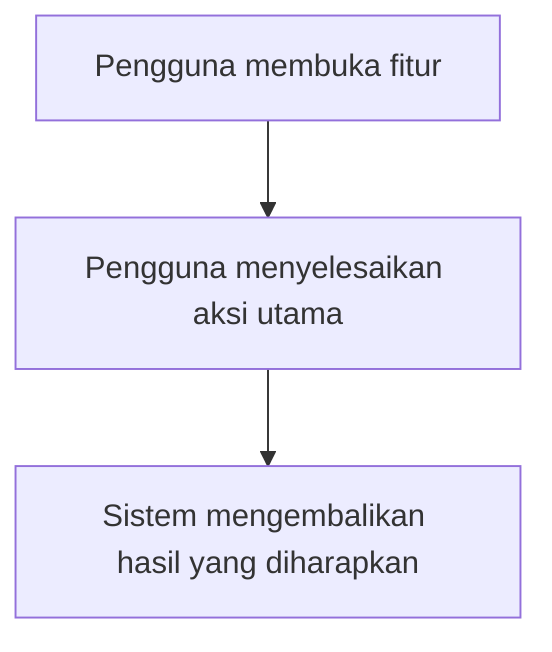
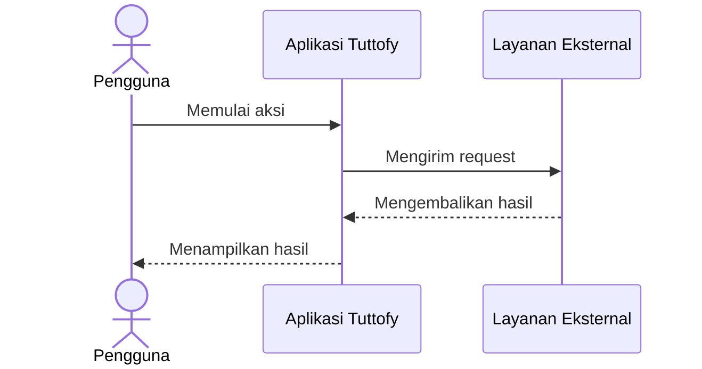

# Nama Fitur

## Gambaran Umum

Jelaskan apa itu fitur ini dalam satu paragraf singkat. Fokus pada perilaku produk dan posisi fitur ini dalam pengalaman Tuttofy.

## Tujuan

Jelaskan mengapa fitur ini ada, masalah apa yang diselesaikan, dan hasil apa yang didukung untuk bisnis atau perjalanan tutor/pembelajar.

## Pengguna / Peran

Daftarkan peran yang berinteraksi dengan fitur ini. Gunakan istilah produk seperti pembelajar, tutor, admin, atau tim internal bila relevan.

## Alur Utama

Jelaskan alur utama penggunaan fitur langkah demi langkah. Buat alurnya praktis dan berurutan agar pembaca memahami perilaku fitur dari awal sampai akhir.

## Diagram Visual

Tambahkan minimal satu diagram Mermaid untuk setiap dokumen. Gunakan `flowchart` untuk merangkum perjalanan produk utama, perpindahan layar, atau titik keputusan.

## Sequence Interaksi

Jika fitur melibatkan interaksi bertahap antara pengguna dan satu atau lebih sistem, tambahkan Mermaid `sequenceDiagram`. Bagian ini sangat disarankan untuk authentication, onboarding, integrasi, upload, approval, dan flow berbasis API.

## Aturan Bisnis

Daftarkan aturan penting, batasan, izin, validasi, atau guardrails yang menentukan bagaimana fitur ini boleh berjalan.

## Data / Field

Daftarkan data utama yang digunakan oleh fitur ini. Masukkan hanya field yang relevan secara produk seperti title, status, owner, content type, visibility, atau progress state.

## Edge Cases

Jelaskan skenario yang tidak biasa, error, empty state, isu izin akses, atau kondisi gagal yang perlu dipertimbangkan saat mendefinisikan fitur.

## Fitur Terkait

Daftarkan fitur yang terhubung atau dependensi yang perlu dirujuk ketika seseorang membaca halaman ini.

## Catatan

Tambahkan catatan produk atau catatan teknis ringan yang ringkas untuk membantu tim internal selaras terhadap konteks implementasi, dependensi, atau pertimbangan ke depan.
